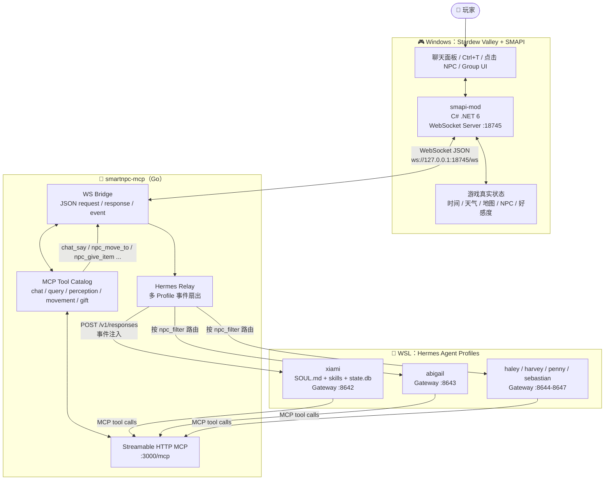
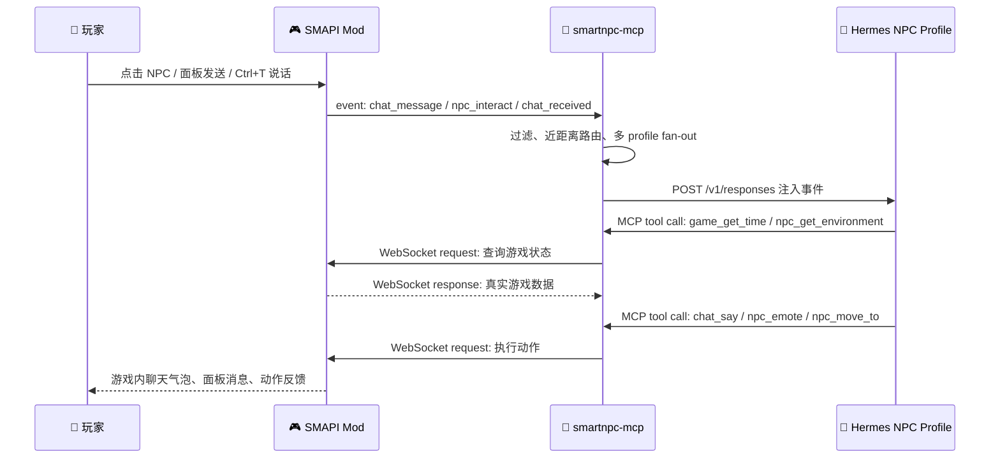
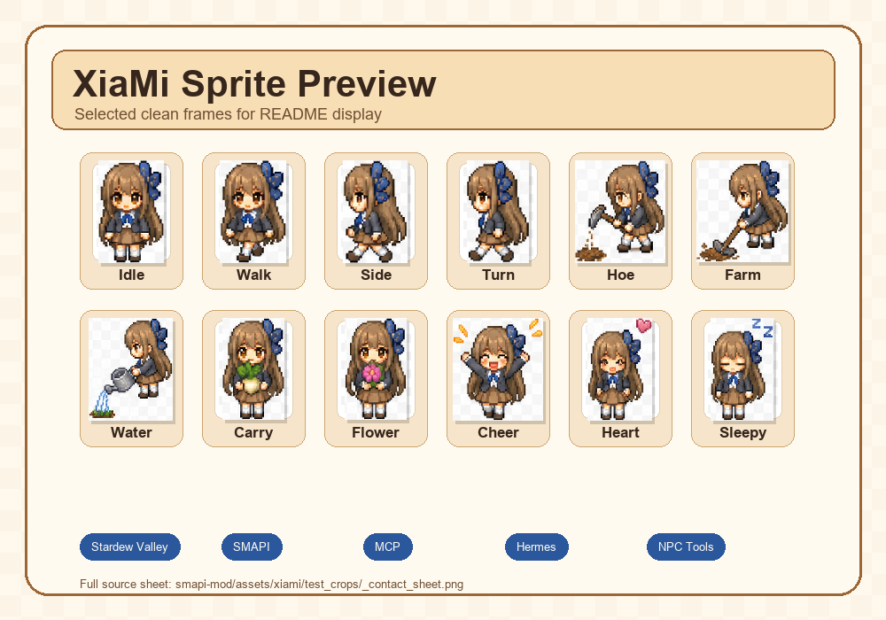

# 🌾 SmartNPC — 让星露谷 NPC 真正“活”起来

> **Hermes-first AI NPC runtime for Stardew Valley**  
> 用 SMAPI + WebSocket + MCP + Hermes Profiles，把星露谷里的 NPC 变成拥有**人格、记忆、工具能力、主动行为**的智能角色。

<p align="center">
  
  <br />
  <em>示例自定义 NPC：XiaMi。她不只是会说话，还能理解时间、位置、天气、好感度，并调用游戏工具行动。</em>
</p>

---

## ✨ 项目亮点

| 能力 | 说明 |
|---|---|
| 💬 **沉浸式聊天** | 游戏内 QQ 风格聊天面板、私聊、未读提示、Toast 通知；点击 NPC 或按快捷键即可对话。 |
| 🧠 **人格与长期记忆** | 每个 NPC 一个 Hermes profile：`SOUL.md` 定义灵魂，`skills/` 定义行为策略，`state.db` 保存记忆。 |
| 🛠️ **20+ 游戏工具** | 查询时间/天气/好感度/位置/周边环境，移动、跟随、带路、表情、送礼、发消息等。 |
| 👂 **近距离听见你说话** | 玩家用原版聊天框说话时，SMAPI 侧会扫描附近可听见的 Agent NPC，自动路由给最近的角色。 |
| 👥 **多 NPC Profile 扇出** | 单个 `smartnpc-mcp` 连接游戏 WebSocket，再按 NPC 名字把事件分发给 XiaMi / Abigail / Haley / Harvey / Penny / Sebastian 等 profile。 |
| 🔒 **硬边界安全校验** | MCP/SMAPI 层负责参数、NPC 是否存在、地图是否合法、游戏线程安全、超时/重连等硬规则；LLM 只负责“怎么想”。 |

---

## 🧭 当前架构：Hermes-first

SmartNPC 当前主线是 **Hermes-first**：

- `smapi-mod/`：贴近游戏线程，负责 UI、NPC sprite、输入捕获、动作执行、WebSocket Server。
- `smartnpc-mcp/`：能力边界，负责 MCP 工具、协议转换、事件分发、硬校验、Hermes relay。
- `hermes/profiles/<npc>/`：决策边界，负责人格、记忆、技能、工具规划、主动行为。

### 架构层流程图



### 一句话链路

> 玩家说一句话 → SMAPI Mod 捕获事件 → `smartnpc-mcp` 转成 Hermes turn → NPC Profile 思考并调用工具 → MCP 把工具请求落回游戏 → NPC 在游戏里说话/移动/表情/送礼。



---

## 🖼️ 视觉资产示例

<p align="center">
  
  <br />
  <em>XiaMi animation showcase: walk cycles, farm actions, gifts, emotes, and the runtime flow. SmartNPC cares about both mind and body: dialogue, memory, actions, and expressions all belong in-game.</em>
</p>

<p align="center">
  <sub>Full raw crop contact sheet: <code>smapi-mod/assets/xiami/test_crops/_contact_sheet.png</code>.</sub>
</p>

---

## 📦 仓库结构

| 路径 | 作用 |
|---|---|
| `smapi-mod/` | C# SMAPI Mod。负责游戏内 UI、NPC 注册、WebSocket Server、查询/动作处理器。 |
| `smartnpc-mcp/` | Go MCP Server。负责工具 schema、WebSocket 客户端、HTTP MCP、事件转发到 Hermes。 |
| `hermes/` | Hermes profile 源文件：每个 NPC 的 `SOUL.md`、skills、配置 overlay、安装脚本。 |
| `docs/` | 架构、协议、事件、MCP 工具、ADR、人工 E2E 验证清单。 |
| `scripts/` | Hermes profile 渲染、启动、调参、重置等辅助脚本。 |
| `Taskfile.yml` | 根任务入口：构建、测试、安装、清理、profile 校验。 |
| `run.bat` | Windows 本机一键启动脚本示例（包含构建、安装、启动 mcp、启动 Hermes、启动游戏）。 |

---

## 🚀 快速开始

> 📖 **新机器接入？** 从零配置 Windows + WSL 环境请读 **[`docs/setup.md`](docs/setup.md)**。  
> 📖 **完整启动手册？** 架构拓扑 → 环境安装 → 手动分步 → 一键启动 → 排查决策树，见 **[`docs/startup-guide.md`](docs/startup-guide.md)**。

### 0. 前置条件

- Stardew Valley 1.6+
- SMAPI 4.0+
- .NET SDK 6.0
- Go 1.22+
- [Task](https://taskfile.dev/)
- 使用 Hermes-first 主链路时：WSL Ubuntu-22.04 + Hermes Agent，并开启 Gateway/API Server

安装 Task：

```powershell
go install github.com/go-task/task/v3/cmd/task@latest
```

准备本机配置：

```powershell
Copy-Item .env.example .env
# 编辑 .env，至少建议配置 SMARTNPC_GAME_PATH 指向 Stardew Valley 安装目录
```

### 1. 构建与本地 CI

```powershell
# 查看所有任务
task --list

# 快速检查：Go vet + tests，跳过 build
task ci-fast

# 完整本地 CI：lint + test + build
task ci

# 只构建关键组件
task mcp:build
task mod:build
```

### 2. 一键启动（适合当前开发机）

如果你的路径、WSL 发行版、Hermes IP 与脚本一致，可直接运行：

```powershell
.\run.bat
```

`run.bat` 会依次完成：

1. 构建 SMAPI Mod + `smartnpc-mcp`
2. 停掉旧的游戏 / MCP / Agent 进程
3. 安装 Mod、同步 Hermes profiles、应用调参
4. 启动 `smartnpc-mcp --http :3000 --hermes-config ...`
5. 启动 Hermes gateways（默认 `xiami,abigail`）
6. 通过 SMAPI 启动 Stardew Valley

> 如果你的 Stardew 路径、Task 路径、WSL IP 不同，请先打开 `run.bat` 修改对应变量。

### 3. 手动启动（推荐理解链路时使用）

#### Step A：安装 Mod

```powershell
task mod:install
```

#### Step B：启动游戏

```powershell
"D:\Stardew Valley\StardewModdingAPI.exe"
```

进入任意存档后，Mod 会在本机启动 WebSocket：

```text
ws://127.0.0.1:18745/ws
```

#### Step C：启动 MCP Server（Windows）

```powershell
$env:SMARTNPC_HERMES_KEY = "smartnpc-test-key"

smartnpc-mcp\bin\smartnpc-mcp.exe `
  --http :3000 `
  --ws-url ws://127.0.0.1:18745/ws `
  --hermes-config D:\SmartNPC\hermes\runtime-config.yaml `
  --log-level debug
```

健康检查：

```powershell
Invoke-WebRequest http://127.0.0.1:3000/healthz
Invoke-WebRequest http://127.0.0.1:3000/status
```

#### Step D：同步并启动 Hermes Profiles（WSL）

```bash
bash /mnt/d/SmartNPC/hermes/install.sh
bash /mnt/d/SmartNPC/scripts/start_hermes_profiles.sh xiami,abigail
```

单 profile 也可以手动启动：

```bash
hermes -p xiami gateway run --accept-hooks
```

默认端口约定：

| NPC/Profile | Gateway |
|---|---:|
| `xiami` | `:8642` |
| `abigail` | `:8643` |
| `haley` | `:8644` |
| `harvey` | `:8645` |
| `penny` | `:8646` |
| `sebastian` | `:8647` |

> `hermes/runtime-config.yaml` 里记录了 `npc_filter -> gateway_url` 的路由。如果 WSL/Windows IP 变化，需要同步更新该文件以及对应 profile 的 overlay 配置。

---

## 🎮 游戏内怎么用

| 操作 | 效果 |
|---|---|
| `Tab` | 打开/关闭 SmartNPC 聊天面板。 |
| `F2` | 打开聊天面板并聚焦联系人列表。 |
| `Esc` | 关闭聊天面板。 |
| `Ctrl+T` | 打开原版聊天输入；说出的话会按“附近可听见 NPC”路由。 |
| 点击 Agent NPC | 拦截原版对话，打开对应 NPC 的聊天窗口，并触发 `npc_interact`。 |
| `/group Abigail Sebastian` | 创建临时群聊 UI。 |
| `/endgroup` | 结束群聊。 |
| `F3` | 打开调试面板。 |

> 当前 group UI 与协议链路已在 Mod/MCP 侧具备基础能力；Hermes 侧群聊编排仍属于后续完善重点。

---

## 🛠️ MCP 工具速览

### 可见输出

| 工具 | 作用 |
|---|---|
| `chat_say` | NPC 在游戏聊天面板/气泡中说一句话。 |
| `mail_send` | 显示系统 HUD 通知，不建议当作 NPC 台词。 |

### 读游戏状态

| 工具 | 作用 |
|---|---|
| `game_get_time` | 当前时刻、日期、季节、年份。 |
| `game_get_weather` | 天气、是否下雨/下雪/打雷。 |
| `friendship_get` | 玩家与某 NPC 的好感度/关系状态。 |
| `player_get_status` | 玩家是否忙碌、是否在菜单/事件中、当前位置。 |
| `npc_get_position` | NPC 的地图、坐标、朝向、是否移动中。 |
| `npc_get_nearby` | NPC 附近有哪些角色。 |
| `npc_get_environment` | 一次性拿到位置、时间、天气、周边物体等上下文。 |
| `npc_get_named_locations` | 农场地标表，用于“带我去湖边/大门”等自然语言命令。 |
| `npc_get_behavior` | 当前是否 idle / summoning / following / leading。 |

### 改变游戏世界

| 工具 | 作用 |
|---|---|
| `npc_move_to` | 让 NPC 去某个 tile；跨地图时会 warp。 |
| `npc_face_direction` | 让 NPC 转向。 |
| `npc_summon` | 把 NPC 召唤到玩家附近并走向玩家。 |
| `npc_emote` | 显示 `!`、爱心、音乐等 Stardew 原生表情泡泡。 |
| `npc_give_item` | NPC 把签名礼物交给玩家。 |
| `npc_follow_start` / `npc_follow_stop` | 开始/停止跟随玩家。 |
| `npc_lead_to` | NPC 走在前面带玩家去某个位置。 |
| `npc_send_message` / `npc_broadcast_event` | NPC 之间私信/广播，并可唤醒目标 Hermes profile。 |

完整目录见 [`docs/mcp-tools.md`](docs/mcp-tools.md)。

---

## 🧩 Profile 开发：给一个 NPC 写“灵魂”

每个 Hermes profile 近似一个“可运行的人格包”：

```text
hermes/profiles/<npc>/
├─ SOUL.md                 # 人格、口吻、边界、签名礼物、关系策略
├─ config-overlay.yaml      # Gateway/MCP/API Server 覆盖配置
├─ cron-recipes.md          # 主动行为/反思/定时触发建议
└─ skills/smartnpc/
   ├─ game-tool-policy/
   ├─ gift-policy/
   ├─ group-chat-reply/
   ├─ inter-npc-message/
   ├─ memory-policy/
   ├─ proactive-greeting/
   └─ proactive-visit/
```

共享 skill 模板位于 `hermes/profiles/_master/`，通过脚本渲染到各 NPC：

```bash
bash scripts/render_profiles.sh
bash scripts/test_profile_render.sh
```

设计细节见 [`docs/hermes-profiles.md`](docs/hermes-profiles.md)。

---

## 🧪 常用开发命令

```powershell
# 全仓库
task --list
task ci-fast
task ci
task tidy
task clean

# MCP
task mcp:build
task mcp:test
task mcp:run WS_URL=ws://127.0.0.1:18745/ws
task mcp:run-echo     # 不接 LLM，直接回声验证游戏往返链路
task mcp:health

# SMAPI Mod
task mod:build
task mod:install
```

---

## 🧑‍💻 开发流程

新增 NPC 行为 / Workflow / Skill / Schedule 的完整分层流程、代码模板和检查清单见：

> 📖 **[`docs/development-guide.md`](docs/development-guide.md)**

---

## 🚨 运行注意事项

1. **不要同时启动多个 `smartnpc-mcp` 连接 Mod WebSocket。**  
   SMAPI Mod 侧 WebSocket 只应由一个 MCP 客户端占用；多实例会争抢连接。

2. **Hermes 要在能访问 `:3000/mcp` 的网络环境里启动。**  
   WSL 访问 Windows Host 时可能需要使用 Windows 主机 IP，而不是 `127.0.0.1`。

3. **MCP 最好先于 Hermes Gateway 启动。**  
   Hermes profile 启动时会发现 MCP 工具；如果当时 `:3000/mcp` 不在线，可能缓存到“0 tools”。

4. **Mod 安装前请关闭游戏。**  
   游戏运行时 DLL 可能被锁定，`task mod:install` 会尝试停止相关进程。

---

## 🗺️ 文档地图

| 文档 | 内容 |
|---|---|
| [`docs/setup.md`](docs/setup.md) | **环境配置**。从零配置 Windows + WSL 环境到能跑 `run.bat`。 |
| [`docs/startup-guide.md`](docs/startup-guide.md) | **完整启动手册**。架构拓扑 → 环境安装 → 手动分步 → 一键启动 → 排查决策树。 |
| [`docs/technical-architecture.md`](docs/technical-architecture.md) | **技术架构概要**。四层架构、Schedule 自运转、网络拓扑、行为模型——图文简明版。 |
| [`docs/npc-agent-autonomy.md`](docs/npc-agent-autonomy.md) | 完整技术方案——四层架构详解、Workflow 引擎、FollowSystem、多 NPC 扇出、记忆模型。 |
| [`docs/development-guide.md`](docs/development-guide.md) | **开发手册**。新增 NPC 行为/Workflow/Skill/Schedule 的分层流程、代码模板、检查清单。 |
| [`docs/protocol.md`](docs/protocol.md) | SMAPI Mod ↔ MCP 的 WebSocket JSON 协议。 |
| [`docs/mcp-tools.md`](docs/mcp-tools.md) | MCP 工具目录、参数、错误码、副作用说明。 |
| [`docs/events.md`](docs/events.md) | 游戏事件与 synthetic events 的 payload 规范。 |
| [`docs/hermes-profiles.md`](docs/hermes-profiles.md) | NPC profile 结构、SOUL 设计、skill 渲染机制。 |
| [`docs/hermes-event-trigger.md`](docs/hermes-event-trigger.md) | 为什么选择 MCP POST Hermes Gateway 的事件触发方案。 |
| [`docs/manual-e2e-verification.md`](docs/manual-e2e-verification.md) | 人工端到端验证清单。 |

---

## 📌 当前状态

- ✅ SMAPI Mod WebSocket bridge 与聊天 UI 已落地
- ✅ `smartnpc-mcp` 支持 stdio + Streamable HTTP MCP
- ✅ Hermes-first 事件注入链路：`smartnpc-mcp -> Hermes /v1/responses`
- ✅ 多 profile 配置与 fan-out：XiaMi、Abigail、Haley、Harvey、Penny、Sebastian
- ✅ 工具能力覆盖聊天、查询、移动、感知、跟随、带路、送礼、NPC 间消息
- ✅ 旧 `smartnpc-agent/` Go 编排器已移除（历史代码见 git history）

---

## License

This project is licensed under the [MIT License](LICENSE).

---

<p align="center">
  <strong>SmartNPC 的目标：</strong><br />
  不是“让 NPC 偶尔回一句话”，而是让他们在星露谷里拥有可持续的身份、记忆、关系和行动力。
</p>
