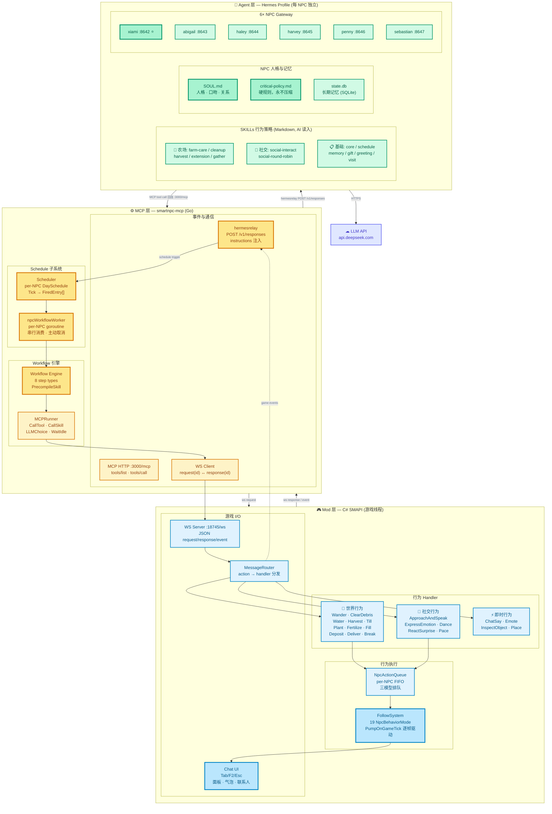

# SmartNPC 架构图



**三层层间关系：**

```
Agent 层 (Hermes)  ←──→  MCP 层 (Go)  ←──→  Mod 层 (C#)
     决策                   编排                  执行
  "怎么想"              "何时做"             "怎么做"
```

**两条数据流：**

| 流向 | 路径 |
|------|------|
| ⏰ Schedule | `day_started → npc_plan_day → Scheduler → Tick → Worker → skill_call → Agent → MCP tool → ws → FollowSystem` |
| 📡 Event | `chat_message → ws event → hermesrelay → POST /v1/responses → Agent 决策 → MCP tool call → ws → 游戏执行` |
