# 星露谷智能NPC项目设计文档
## 1.概述
简单介绍这是一个什么样的项目，并简单描述其功能即可
SmartNPC 是一个面向《星露谷物语》（Stardew Valley）的智能 NPC 原型项目。项目目标不是简单地让 NPC 偶尔生成一句回复，而是把 NPC 变成具备人格、记忆、工具调用能力、游戏内行动能力和主动行为能力的可交互角色。

## 2.项目功能介绍
    
本项目聚焦于将 Hermes Agent 工作流融入 NPC 控制与决策流程，以提升玩家与 NPC 的交互体验。系统通过 MCP 将游戏流程抽象成一组可调用接口，例如查询时间、天气、位置、好感度，或让 NPC 说话、移动、跟随、送礼、发送 NPC 间消息等。Hermes Agent 则负责 NPC 的人格表达、长期记忆、技能策略、工具规划和主动行为调度。
    
### 2.1 聊天

<figure>
  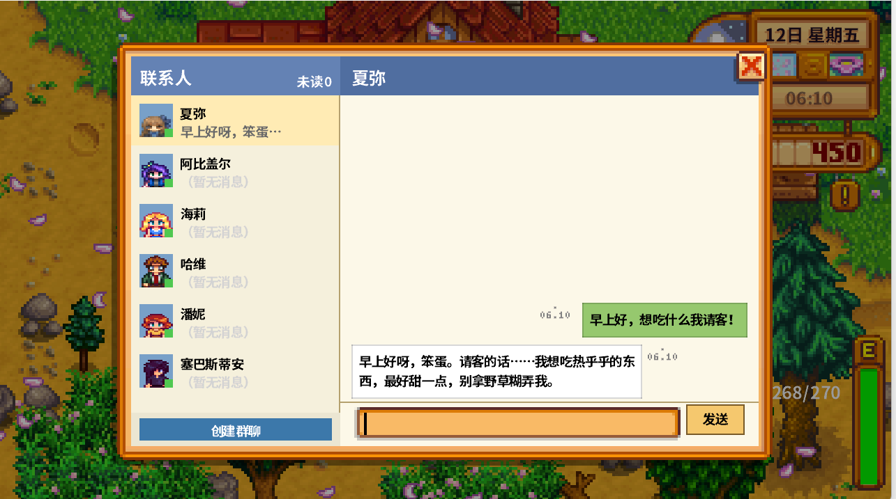
  
    <figcaption>图 1. 与带有人设的 NPC 对话</figcaption>
  
</figure>

### 2.2 群聊
<figure>
  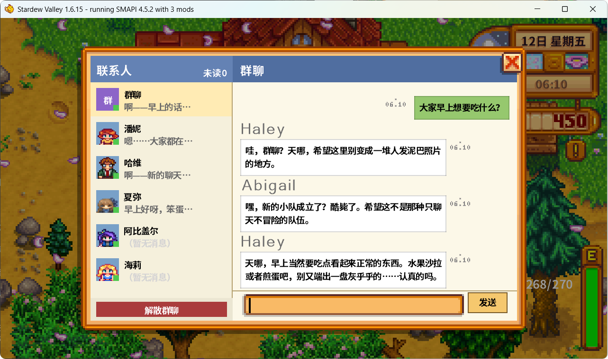
</figure>

<figure>
  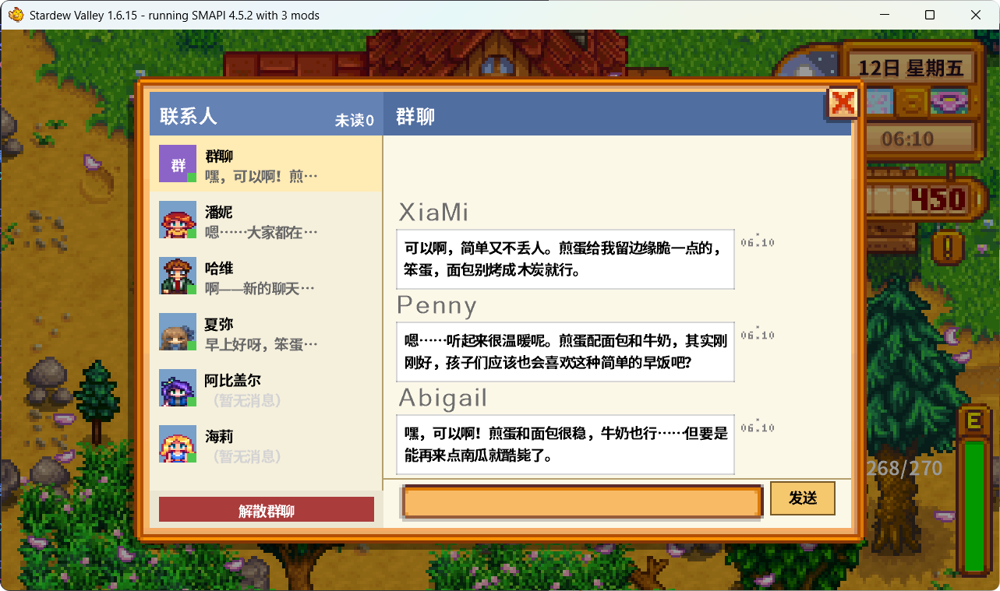
</figure>

<figure>
  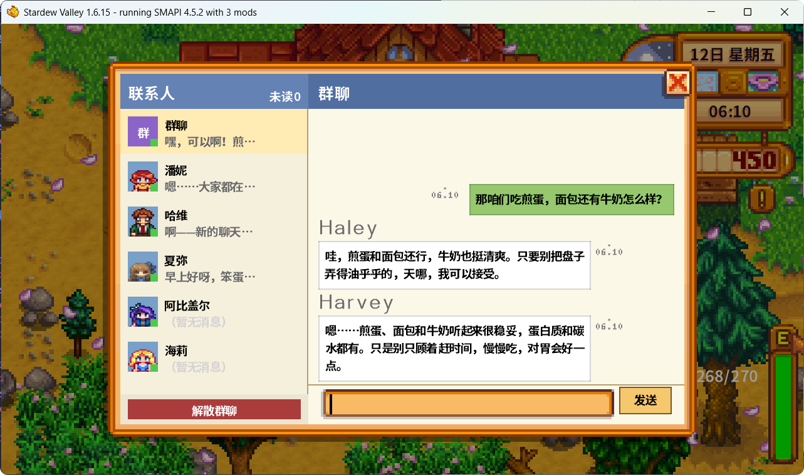
  
    <figcaption>图 2-5. 与若干 NPC 群聊 </figcaption>
  
</figure>

### 2.3 委托
<figure>
  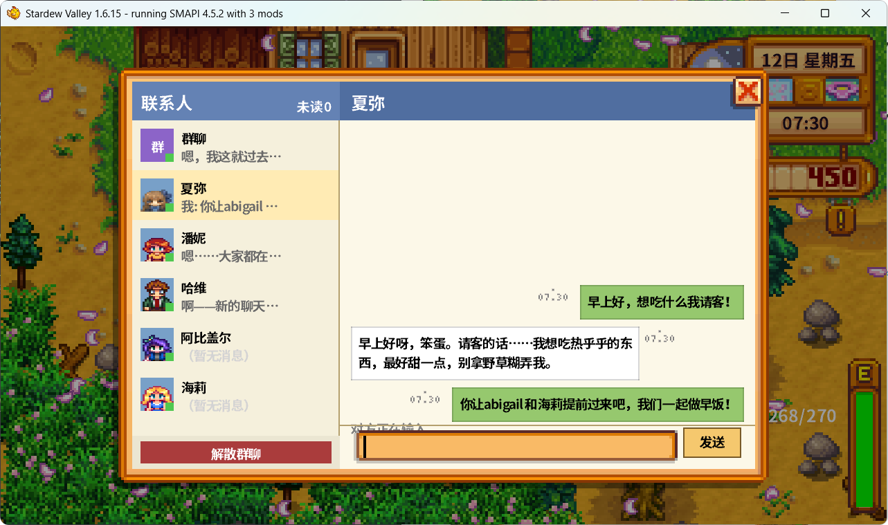
  
    <figcaption> 向 NPC 发布委托任务</figcaption>
  
</figure>

<figure>
  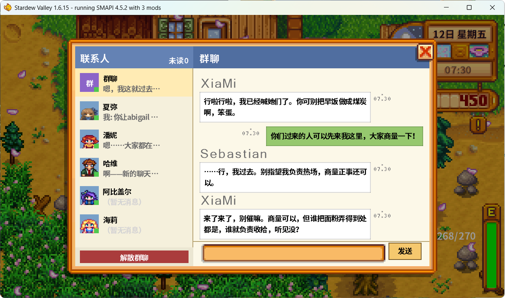
  
    <figcaption> NPC 完成并响应委托任务</figcaption>
  
</figure>

<figure>
  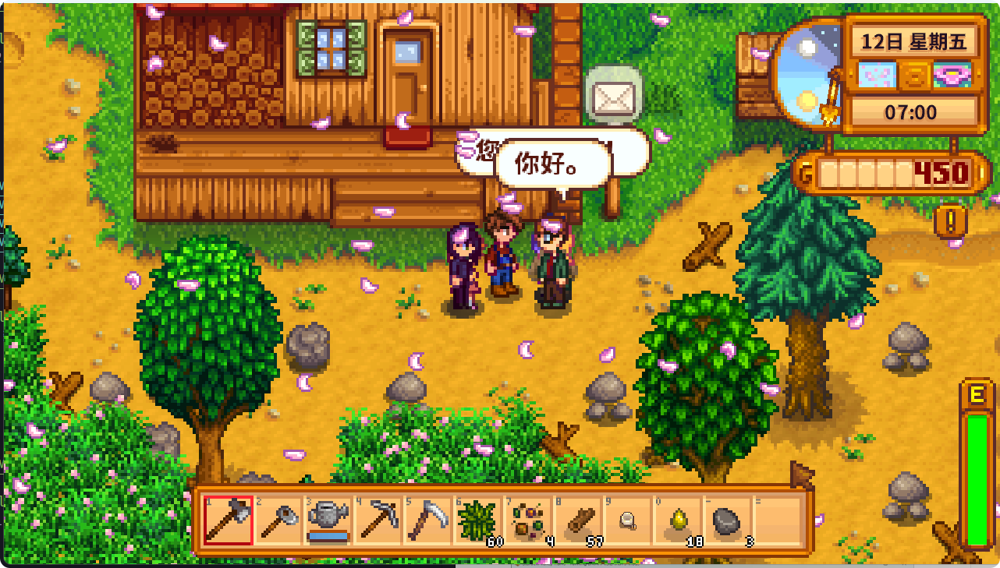
  
    <figcaption> 其他 NPC 完成指定任务 </figcaption>
  
</figure>

### 2.4 NPC主动行为

<figure>
  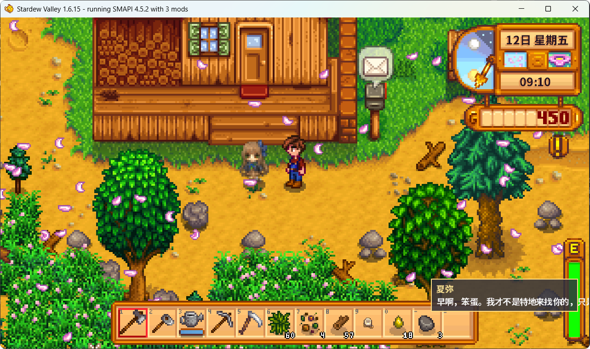
  
    <figcaption> 定时主动传唤一个 NPC </figcaption>
  
</figure>

### 2.5 游戏事件记忆

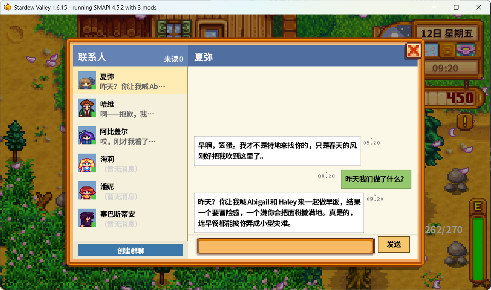

<figure>
  
  
    <figcaption>即使重新启动游戏，NPC 依然有过去发生的游戏事件的记忆</figcaption>
  
</figure>

### 2.6 好感度系统

<figure>
  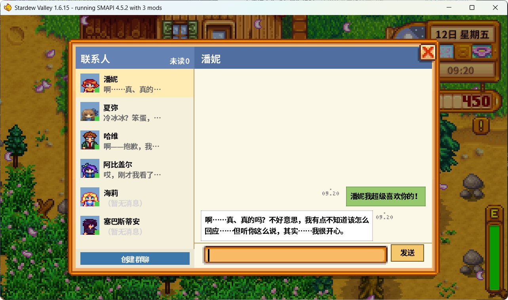
  
    <figcaption> NPC 会根据互动调整好感度与行为</figcaption>
  
</figure>

例如：
| 好感度 | Sample opening |
|---|---|
| 0-2 | "哦？又是你。怎么，今天又想不开跑来找我聊天？" |
| 3-5 (sunny morning) | "这么早就来找我，笨蛋是不是想骗早饭？" |
| 6-8 (rainy afternoon) | "……下这么大的雨还跑过来。别误会，我只是顺便问一句。" |
| 9-10 (evening) | "天都黑了。……今天，过得还行吧？" |

## 3.详细技术方案

### 3.1 技术架构

SmartNPC 的整体架构可以概括为：**游戏侧负责接入，Go 服务负责协议桥接，Hermes 负责智能体运行，LLM 负责语言生成与行为规划**。这样的分层设计可以避免游戏 Mod 直接承载复杂 AI 逻辑，也便于后续扩展更多 NPC、更多工具和更多行为能力。

从系统边界看，SmartNPC 由 **四个逻辑层** 和 **两条通信通道** 组成。四个逻辑层分别处理游戏接入、协议转换、事件分发和智能体决策；两条通信通道分别承担“游戏事件上送”和“LLM 工具回调”的任务。

#### 3.1.1 四层职责划分

| 层 | 名称 | 实现 | 主要职责 | 边界约束 |
|----|------|------|----------|----------|
| L1 | 游戏接入层 | `smapi-mod/`（C# / .NET 6） | 接入 Stardew Valley：捕获玩家输入、读取游戏状态、将 NPC 回复和动作渲染回游戏 | 不直连 LLM，不保存业务状态，不做复杂决策 |
| L2 | 协议桥接层 | `smartnpc-mcp/`（Go） | 在 WebSocket 与 MCP HTTP 之间做协议转换；合成事件；执行一问一答等运行时约束 | 不做人格判断，不持久化 NPC 记忆 |
| L3 | 事件分发层 | `smartnpc-mcp/internal/hermesrelay/`（Go） | 将游戏事件按照 NPC 归属分发到对应 Hermes Profile | 不改变事件含义，只负责路由和转发 |
| L4 | 智能体决策层 | `hermes/profiles/<npc>/` + Hermes Gateway | 承载 NPC 的人格、记忆和 skills，并驱动 LLM 决定调用哪些 MCP 工具 | 不直接调用游戏 API，只通过 MCP 工具行动 |

这四层形成了一条清晰的闭环：**游戏产生事件 → MCP 转换事件 → Hermes 理解决策 → MCP 工具回写 → 游戏执行动作**。

#### 3.1.2 架构总览图

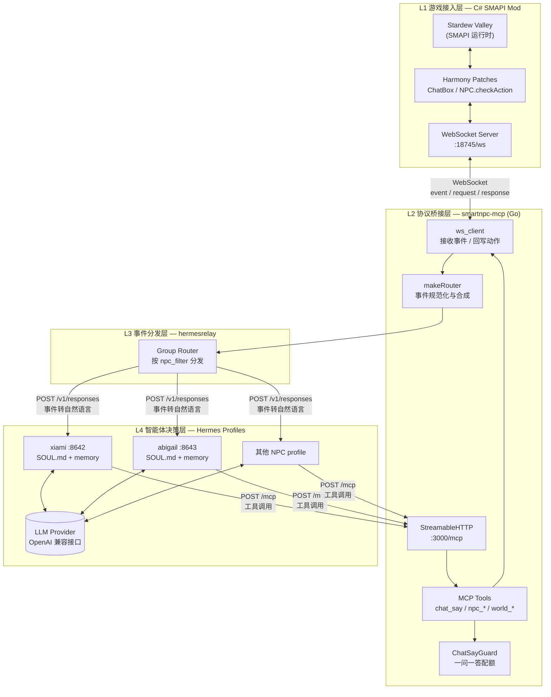

从图中可以看到，`smartnpc-mcp` 是整个系统的中枢：它向左连接游戏 Mod，向右连接 Hermes Profile。它既不替 NPC 思考，也不直接修改游戏世界，而是把两边的协议和语义对齐。

#### 3.1.3 两条通信通道

系统中存在两条方向和目的都不同的通信通道：

| 通道 | 协议 | 方向 | 主要用途 | 设计特点 |
|------|------|------|----------|----------|
| **A. 游戏 WebSocket 通道** | WebSocket | Mod ↔ MCP，双向 | 玩家输入上送、NPC 动作回写、游戏状态查询 | 本机低延迟，单客户端连接，支持断线重连 |
| **B. MCP HTTP 通道** | MCP Streamable HTTP | Hermes → MCP | Hermes 在 LLM 决策后调用 MCP 工具 | 适合跨主机、WSL 或容器部署，通过请求 ID 关联结果 |

之所以不把所有通信都塞进一条通道，是因为两端的运行环境不同：Mod 运行在游戏进程内，更适合通过本地 WebSocket 与 Go 服务通信；Hermes Profile 可能运行在 WSL、容器或远程机器中，更适合通过 HTTP 访问 MCP 工具。这样拆分后，游戏接入与 AI 接入互不耦合，部署位置也更加灵活。

#### 3.1.4 NPC Profile 隔离设计

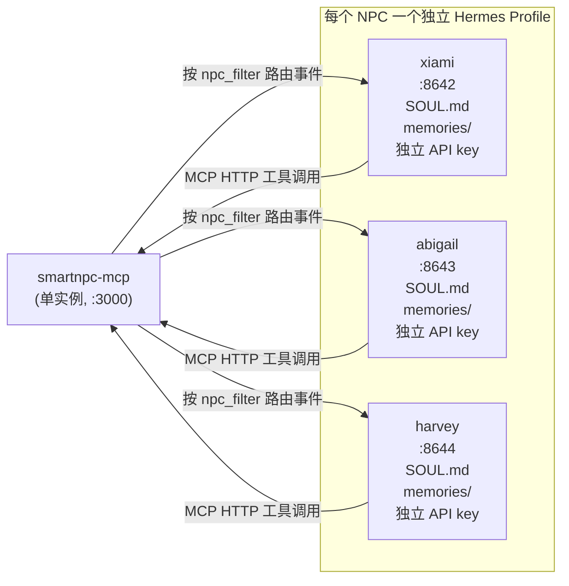

每个 NPC 都拥有独立的 Hermes Profile，包括独立的人格文件、记忆目录、端口和 API key。这样做的好处主要有三点：

- **Agent 人格相互独立**：`XiaMi` 的说话风格、记忆和行为偏好不会影响 `Abigail`。
- **发生故障可隔离**：某个 NPC 的 Hermes Gateway 挂掉，只会影响该 NPC，不会拖垮整个系统。
- **扩展 NPC 更简单**：新增 NPC 时，只需要新增 profile，并在 `hermes/runtime-config.yaml` 中配置 `npc_filter` 和 `gateway_url`。

#### 3.1.5 MCP 工具是 NPC 的能力边界

LLM 并不直接调用 Stardew Valley API，而是通过 MCP 工具间接影响游戏世界。换句话说，MCP 工具定义了 NPC 能做什么，也定义了系统的安全边界。

| Domain | 代表工具 | 对应游戏能力 |
|--------|----------|--------------|
| chat | `chat_say` | NPC 在 ChatPanel 或对话框中说话 |
| npc | `npc_move` / `npc_follow` / `npc_face` | 移动、跟随、转向等 NPC 行为 |
| world | `world_time` / `world_weather` / `world_location` | 查询时间、天气、地图位置等世界状态 |
| mail | `mail_send` / `npc_send_mail` | 发送邮件或 NPC 间消息 |
| meta | `ping` / `version` | 协议连通性和版本自检 |

因此，扩展 NPC 能力的路径也很清晰：新增一个 Go MCP 工具，在 Mod 侧补充对应的 WebSocket action handler，并同步更新协议文档。Hermes 和 LLM 不需要了解底层 SDV API 的细节，只需要学会何时调用这些工具。

---

### 3.2 玩家与 NPC 对话流程

玩家与 NPC 的普通对话是 SmartNPC 中最基础、也最能体现整体架构的流程。一次完整对话大致经历以下步骤：玩家输入一句话，Mod 捕获并上送事件，MCP 将事件转换为定向消息，Hermes 根据 NPC 人格与记忆生成回复，最后再通过 MCP 工具把回复渲染回游戏。

#### 3.2.1 端到端时序

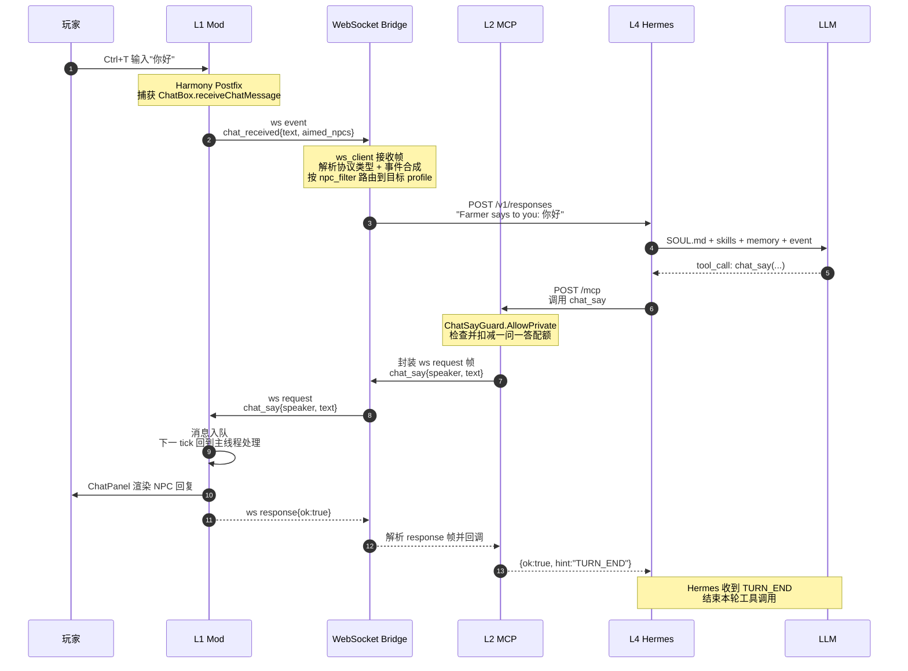

这个流程的关键点在于：玩家输入本身并不直接指定某个 NPC，而是先由 Mod 计算“谁能听见”，再由 MCP 选择最近的 NPC 作为本轮私聊对象。这样既符合游戏空间感，也避免了 LLM 自行猜测对话对象。

#### 3.2.2 关键环节要点

| # | 环节 | 解决的问题 | 关键实现 |
|---|------|------------|----------|
| 1 | 输入捕获 | 如何拿到玩家在游戏聊天框中的输入 | Harmony postfix 拦截 `ChatBox.receiveChatMessage`，并通过玩家 UID 过滤非本地消息 |
| 2 | 可听见 NPC 解析 | 玩家没有显式指定 NPC 时，系统如何判断谁应该回应 | `AudibleNPCResolver` 按距离排序，选择最近的托管 NPC |
| 3 | 事件合成 | 如何把“广播式聊天输入”变成“发给某个 NPC 的消息” | `synthChatMessageFromAudible` 将 `chat_received` 转为 `chat_message{npc:...}` |
| 4 | 事件分发 | 多个 NPC 同时在线时，如何避免串台 | hermesrelay 根据 `npc_filter` 只把事件投递给目标 Hermes Profile |
| 5 | 语义转换 | LLM 不需要直接理解底层 JSON 协议 | `FormatForHermes` 将结构化事件转成自然语言，如 `Farmer says to you: ...` |
| 6 | 回复约束 | 如何避免 LLM 一次连续调用多次 `chat_say` 刷屏 | `ChatSayGuard` 负责硬性配额，`TURN_END` 负责提示 Hermes 停止本轮调用 |
| 7 | 游戏渲染 | 如何保证 SDV API 调用发生在安全线程 | ws 线程只负责入队，真正渲染在 `UpdateTicked` 的主线程完成 |

#### 3.2.3 一问一答状态机

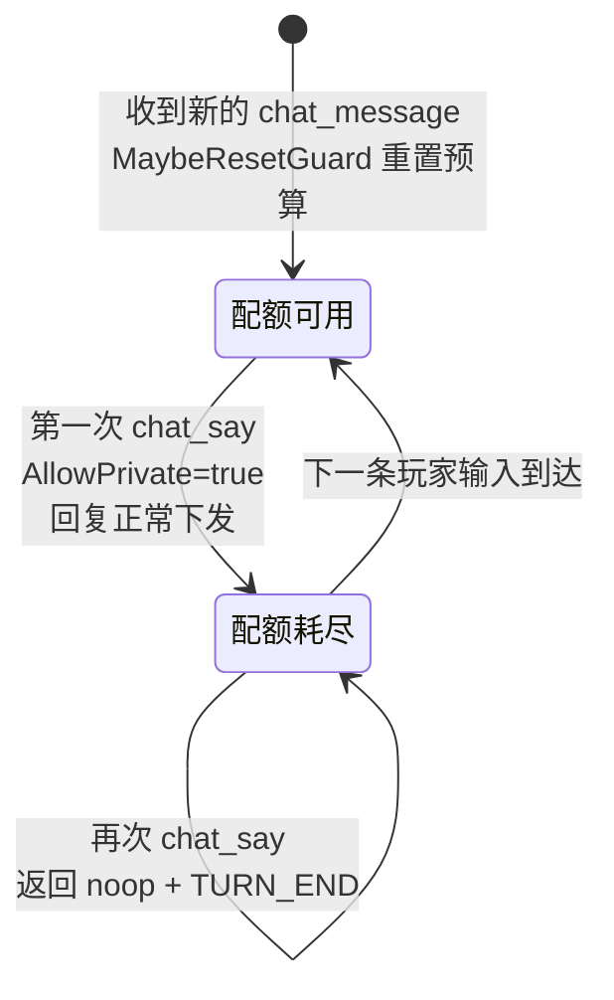

仅靠 prompt 告诉 LLM“只说一句”并不可靠，因此系统在运行时增加了硬约束：每个入站私聊事件只允许对应 NPC 调用一次 `chat_say`。如果 LLM 继续尝试说第二句，工具会返回 noop，并在 hint 中写入 `TURN_END`，提示 Hermes 停止本轮工具调用。

---

### 3.3 玩家驱动 NPC 行为流程

在 SmartNPC 中，“说话”只是 NPC 行为的一种特例。当玩家说“过来一下”“跟着我”“送我一个东西”等指令时，Hermes 可以不选择 `chat_say`，而是选择 `npc_move`、`npc_follow`、`give_item` 等行为类工具。也就是说，3.2 中“玩家输入 → Hermes 理解”的前半段流程可以完全复用，差异主要发生在 **MCP 工具 → Mod action → Stardew API** 这一段。

#### 3.3.1 行为流程总览

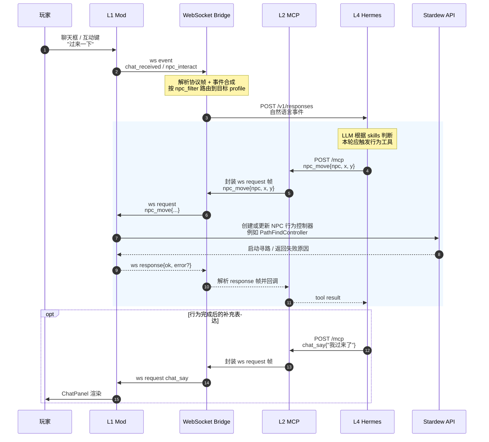

行为流程的核心思想是：LLM 负责“决定要做什么”，MCP 工具负责“把意图变成协议”，Mod 负责“把协议落到 Stardew API”。这样既保留了 LLM 的灵活性，又把真正影响游戏世界的操作限制在可控的工具范围内。

#### 3.3.2 工具、action 与 SDV API 的三层映射（示意）

| MCP 工具 | ws action | Mod 侧落地方式 | 典型失败原因 |
|----------|-----------|----------------|--------------|
| `chat_say` | `chat_say` | 将文本加入 ChatPanel 或对话框 | `mod_not_ready` / `invalid_params` |
| `npc_move` | `npc_move` | 为 NPC 创建寻路控制器，例如 `PathFindController` | `path_blocked` / `npc_not_found` |
| `npc_follow` | `npc_follow` | 通过自定义跟随逻辑和 `UpdateTicked` 持续更新目标 | `npc_busy` |
| `give_item` | `give_item` | 调用玩家背包相关 API 添加物品 | `inventory_full` / `item_not_found` |
| `mail_send` | `mail_send` | 写入 SDV 邮箱或邮件队列 | `unknown_recipient` |

完整工具清单以 `internal/tools/registry.go` 中的 `RegisterAll` 为准。新增行为能力时，需要同步补充 Go 侧工具定义、Mod 侧 action handler、协议文档和测试用例。

#### 3.3.3 主线程串行化

Stardew Valley 的许多 API 只能在游戏主线程安全调用。因此 Mod 侧不能在 WebSocket 接收线程里直接操作 NPC、地图或玩家背包，而是采用“接收线程入队，游戏主线程出队执行”的统一模式。

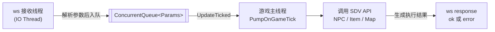

这种设计有三个好处：

- **线程安全**：所有真正触碰游戏对象的操作都在主线程完成。
- **天然限流**：队列按游戏 tick 消化，避免大量工具调用同时冲击游戏循环。
- **状态一致**：行为执行、动画推进和 UI 渲染都与游戏帧同步，玩家看到的结果更稳定。

#### 3.3.4 多行为流程的串行编排

一个复杂行为通常不是单个工具调用，而是一组工具调用的组合。Hermes 会根据每一步工具的返回结果决定下一步，因此更像是一个“感知—行动—反馈—再行动”的闭环。

| 模式 | 工具序列 | 设计意图 |
|------|----------|----------|
| 走过来再说话 | `npc_move` → `chat_say` | NPC 先移动到玩家附近，再进行对话 |
| 收到礼物后回礼 | `give_item` → `chat_say` | 先完成物品交互，再用语言表达反应 |
| 引导玩家 | `chat_say` → `npc_move` | 先说明意图，再带玩家去某个位置 |
| 失败后解释 | `npc_move` → `path_blocked` → `chat_say("那边过不去")` | 行为失败时不沉默，而是把失败原因转化为自然语言反馈 |

目前更适合采用串行编排：上一个工具返回 `ok` 或 `error` 后，Hermes 再决定下一步。这样虽然会增加一点延迟，但可以让 NPC 的行为更可信——它不是一次性“猜完所有动作”，而是根据真实执行结果逐步调整。

#### 3.3.5 失败处理与重规划闭环

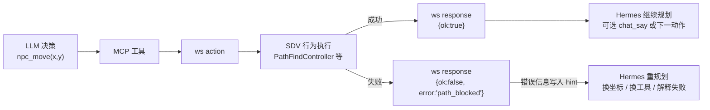

行为失败时，系统不会简单吞掉错误，也不会把异常直接暴露给玩家。标准做法是：Mod 返回 `{ok:false, error:{code, message}}`，MCP 工具将错误转换成 Hermes 能理解的 `hint`，再交给 LLM 决定如何重规划。这样一来，NPC 不仅能“执行动作”，还能在动作失败时做出合理解释，例如“那边被挡住了，我过不去”。这也是让 NPC 显得更有判断力的重要一环。

## 4.未来展望
<!-- 结合星露谷提供的API，看看还可以接入哪些NPC行为功能，如果发现接入的NPC行为功能有限，无法让NPC变的有灵魂，可以说明原因是什么，是因为星露谷提供的API能力有限，或者是其他什么原因？
    此外也可以提一提在技术方案上可以长期优化的点 -->

4.1 更多可能的行为拓展
    
+ Agent 主动行为可以设置得更加智能，例如根据当前 NPC 的位置、近期经历的事件由 Agent 决定是否需要寻找玩家进行交流。SMAPI 提供了直接查看以及改变世界状态的接口，可以尝试实现 NPC 自动农场。

4.2 上下文的冗余

+ 当前大模型算力有限，且 Agent 编排流程存在较多冗余上下文与可优化的空间，而且 Hermes Agent 自身存在较多内置的 Tool , 这些 Tool 在实际使用中几乎不会被调用，但是却占据了不小的上下文，影响大模型的相应与判断，后续可以尝试精简 Hermes Agent 编排或者自制 Agent 以剔除冗余流程。

4.3 Agent 模型的多级管理
    
+ 当前项目在初期采用了 gpt-5.5 模型处理所有流程，后续可以引入其他模型并多级化管理，简单的总结应答完全可以使用更轻量级的模型，效果不会丢失太多的同时响应速度也会有所提高，而对于复杂场景进行判断与决策的时候应该使用可以承载更长上下文、产出质量更高的模型。

4.4 给 NPC 行为加“任务状态机”

+ 如果需要实现复杂任务的执行，应该引入任务状态机而不只是简单的几次工具调用，这样可以使 Agent 在受到复杂任务的时候可以进行计划、中途取消、查询进度、恢复等处理。