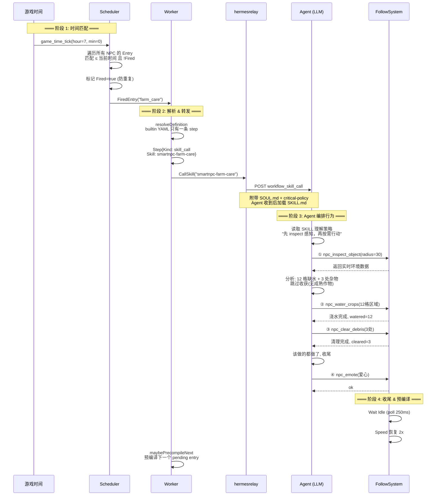
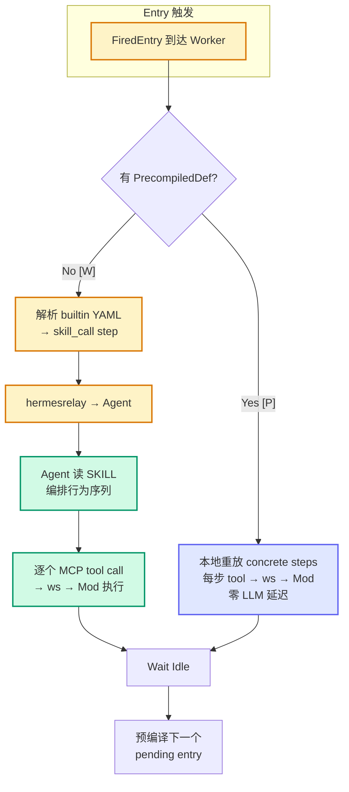
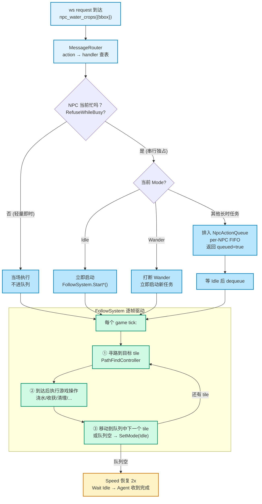

# Schedule 子系统设计

> NPC 如何生成全天日程、到点如何触发、Agent 如何编排行为、Mod 层如何执行——从日程到游戏动作的完整链路。

---

## 3.2 Schedule 生成方案

每天开始时 `day_started` 事件**广播给所有 NPC**，每个 Agent 独立规划全天日程：


每条 Entry = **触发时间**（10 分钟精度）+ **workflow_id** + **参数**。LLM 通过 `workflow_list` 获知可选 workflow 及 input schema，按 NPC 人设和季节天气编排 8-20 条日程。

```mermaid
gantt
    title XiaMi 夏季第 15 天日程
    dateFormat HH:mm
    axisFormat %H:%M
    tickInterval 2hour

    section 农场工作
    farm_care (巡视)            :w1, 07:00, 60min
    farm_cleanup (清理)         :w2, 12:00, 40min
    farm_evening_close (收尾)   :w3, 17:00, 50min

    section 社交休息
    social_interact (社交)      :s1, 09:30, 40min

    section 资源
    resource_gather (采集)      :r1, 14:00, 40min
```



Entry 支持三种形态：**引用内置 workflow**（推荐）、内联 JSON 定义、以及已禁用的单 tool 字段。存储为纯内存，`day_started` 清空，支持 `npc_get_schedule` 查询剩余条目。

---

## 3.3 时间点任务 Skill 编排与执行

### 一句话概括

到点后，MCP 层将 workflow 转发给 Agent，Agent 读 SKILL 后自行编排行为序列，逐个调 MCP tool 下达 Mod 层执行。

### 完整触发链路



### 关键设计

**MCP 层不编排步骤。** 内置 workflow YAML 只有一条 `skill_call`——把执行权完整委托给 Agent。真正的工作流步骤（先 inspect 感知，再 water/harvest/clear，最后 emote 收尾）全部由 Agent 在读取 SKILL 后实时生成。

**Agent 根据结果动态调整。** 每次 tool call 的返回结果会影响下一步决策——如果 inspect 发现没有需要浇水的作物，Agent 会跳过浇水直接做下一步。这保证了执行灵活性。

**同 NPC 严格串行。** 每个 NPC 独占一个 goroutine（`npcWorkflowWorker`）和一个 channel。新 schedule entry 触发时，自动 cancel 该 NPC 上一个还在跑的 workflow，确保不会同时执行两个动作。

### 两种执行路径



| | 实时编排 [W]（默认） | 预编译 [P]（可选） |
|---|---|---|
| LLM 参与 | 每次触发 | 仅预编译时一次 |
| 延迟 | 1-5s | ~0 |
| 适用场合 | 日常运行 | 重复性高、环境变化小的任务 |

**预编译原理：** 提前让 Agent 在"录制模式"下跑一次 SKILL——读工具正常获取实时数据，写工具被拦截记录而非真执行。产生的步骤序列保存到 `Entry.PrecompiledDef`，触发时直接回放。

### step 类型一览

| step | 作用 | 来源 |
|------|------|------|
| `skill_call` | 委托 SKILL 给 Agent 实时决策 | 内置 YAML（唯一使用的类型） |
| `tool` | 调指定 MCP 工具（参数已确定） | 预编译产物（Agent 提交） |
| `branch` | 基于变量条件分支 | 预编译产物 |
| `random` / `foreach` | 随机选择 / 遍历列表 | 预编译产物 |
| `wait` / `stop` | 等待 Idle / 提前终止 | 预编译产物 |

---

## 3.4 Mod 层游戏状态实现

### 一句话概括

每个 MCP 工具调用到达 Mod 层后，被路由到对应 Handler，Handler 决定立即执行还是排队，最终由 FollowSystem 在游戏 tick 中逐帧驱导 NPC 寻路、播放动画、修改游戏状态。

### 从指令到动作



### 三种任务模型

Mod 层按任务的执行特性把 Handler 分为三类：

| 模型 | 特征 | 典型行为 | 数量 |
|------|------|---------|------|
| **轻量即时** | 瞬间完成，不关心 NPC 状态 | 聊天气泡、头顶表情、查看周围物体 | 3+ |
| **串行独占** | 需要时间执行，同 NPC 排队 | 浇水、收割、清理杂物、耕地、播种、施肥、存取物品、砍树碎石、采集、靠近玩家 | 14 |
| **可抢占** | 低优先级填充行为 | 随意漫步（被高优任务打断） | 1 |

**串行队列机制：** 每个 NPC 维护一个 FIFO 任务队列。当前任务执行完毕后，FollowSystem 在下一 tick 自动 dequeue 并启动下一个排队任务。Agent 在提交任务时如果 NPC 正忙，会收到 `queued=true, position=N`，知道任务将在第 N 位执行。

### NPC 在游戏中的表现

- **移速变化**：Agent 驱动时 5 倍速（正常行走的 2.5 倍），任务结束恢复 2 倍速
- **头顶气泡**：行为开始前显示简短标签（`[water_crops]`），长时任务每秒刷新气泡并附带已用秒数
- **寻路容错**：同一目标连续寻路失败 5 次后自动跳过，避免卡死在不可达 tile
- **超时保护**：清理杂物有独立超时上限（15 秒），防止大面积清理阻塞后续任务

---

## 总结：一条 Entry 的完整旅程

```
7:00 farm_care entry 的旅程:

┌─ 生成 ───────────────────────────────────────────┐
│ day_started → Agent 规划 → npc_plan_day → 存入   │
└──────────────────────────────────────────────────┘
                      ↓ 游戏时间推进
┌─ 触发 ───────────────────────────────────────────┐
│ game_time_tick → Tick 匹配 → FiredEntry → Worker │
└──────────────────────────────────────────────────┘
                      ↓
┌─ 转发 ───────────────────────────────────────────┐
│ resolve YAML → skill_call → hermesrelay → Agent  │
└──────────────────────────────────────────────────┘
                      ↓
┌─ 编排 ───────────────────────────────────────────┐
│ Agent 读 SKILL → inspect → water → clear → emote │
└──────────────────────────────────────────────────┘
                      ↓
┌─ 执行 ───────────────────────────────────────────┐
│ ws → Router → Handler → Queue → FollowSystem     │
│ → 寻路 → 浇水动画 → next tile → ... → Idle       │
└──────────────────────────────────────────────────┘
```
