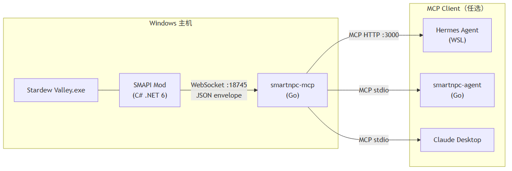
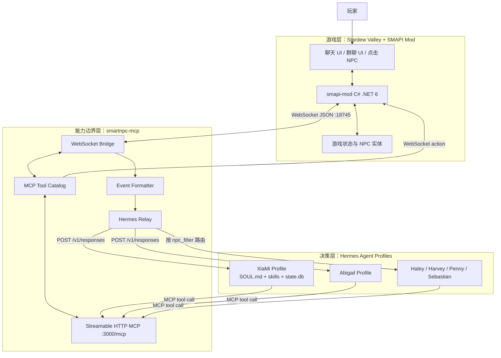
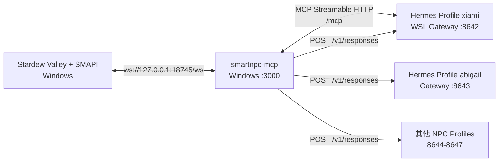
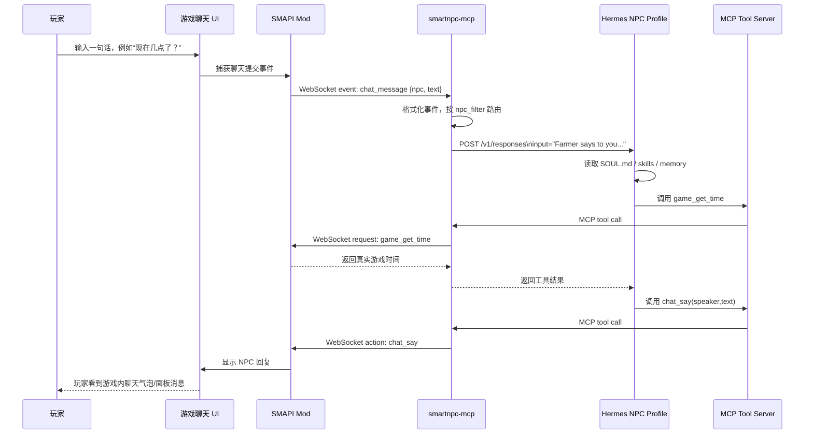
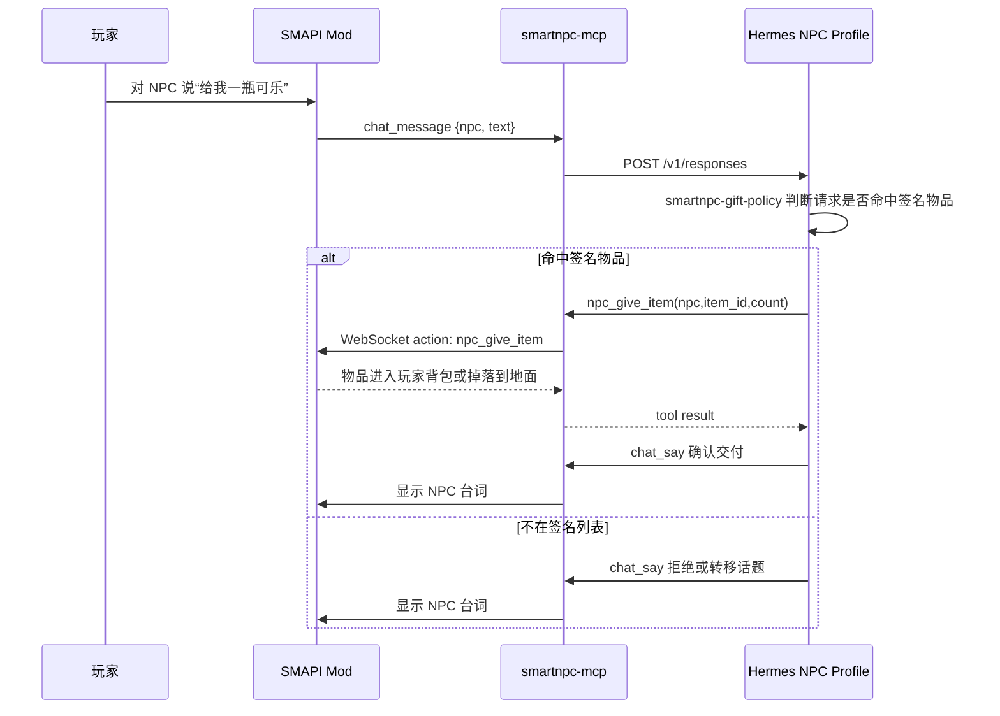
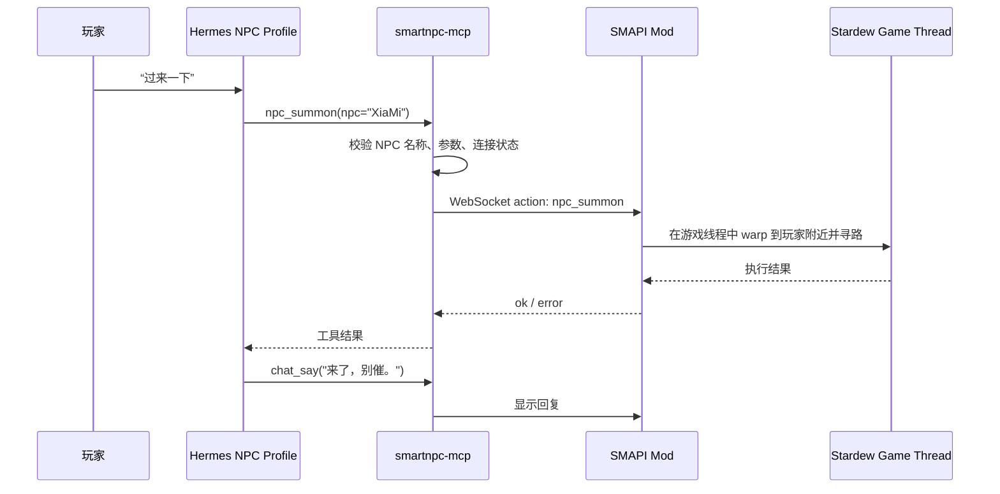

# 星露谷智能 NPC 项目设计文档

> 项目名称：SmartNPC  
> 当前路线：Hermes-first AI NPC Runtime  
> 适用范围：Stardew Valley + SMAPI + smartnpc-mcp + Hermes Agent Profiles

---

## 1. 概述

SmartNPC 是一个面向《星露谷物语》（Stardew Valley）的智能 NPC 原型项目。项目目标不是简单地让 NPC 偶尔生成一句回复，而是把 NPC 变成具备**人格、记忆、工具调用能力、游戏内行动能力和主动行为能力**的可交互角色。

本项目聚焦于将 **Hermes Agent 工作流**融入 NPC 控制与决策流程，以提升玩家与 NPC 的交互体验。系统通过 **MCP（Model Context Protocol）** 将游戏流程抽象成一组可调用接口，例如查询时间、天气、位置、好感度，或让 NPC 说话、移动、跟随、送礼、发送 NPC 间消息等。Hermes Agent 则负责 NPC 的人格表达、长期记忆、技能策略、工具规划和主动行为调度。

简而言之：

- **SMAPI Mod** 负责接入游戏本体，处理 UI、NPC 注册、游戏状态查询和游戏内动作执行。
- **smartnpc-mcp** 负责把游戏能力包装成 MCP 工具，并承担参数校验、协议转换、事件分发等能力边界。
- **Hermes Profile** 负责每个 NPC 的“脑”：人格、记忆、行为规则、工具调用决策和主动行为。

项目当前已经具备：

- 游戏内聊天面板与 NPC 对话；
- 多 NPC profile 路由；
- 群聊上下文支持；
- NPC 间私信/委托消息；
- 查询时间、天气、位置、好感度等游戏状态；
- NPC 移动、召唤、表情、送礼、跟随、带路等游戏行为工具；
- Hermes 长期记忆与 cron 驱动的主动行为能力。

<p align="center">
  
  <br />
  <em>图 1-1：自定义 NPC XiaMi 的动作与表现资源示例。实际文档交付时可替换为游戏内截图。</em>
</p>

---

## 2. 项目功能介绍

### 2.1 聊天

玩家可以通过游戏内 SmartNPC 聊天面板、点击 NPC、或原版聊天输入触发与 NPC 的对话。NPC 并不是简单地返回固定文本，而是会结合自身 profile 中的 `SOUL.md`、Hermes 记忆、当前对话上下文以及必要的游戏状态工具来生成回复。

典型能力包括：

- NPC 使用自己的说话风格回复玩家；
- 对普通寒暄走快速回复路径，减少工具调用延迟；
- 对涉及游戏状态的问题主动查询工具，例如时间、天气、好感度、当前位置；
- 回复通过 `chat_say` 工具回到游戏内聊天气泡或聊天面板；
- 回复内容避免暴露 AI、MCP、JSON、工具调用等底层实现。

示例：

```text
玩家：现在几点了？
Hermes NPC：调用 game_get_time
NPC：都下午了，时间过得真快。你不会又把一整天耗在田里了吧？
```

<p align="center">
  
  <br />
  <em>图 2-1：NPC XiaMi 角色资源示例。建议后续补充“玩家与 NPC 聊天面板”的实机截图。</em>
</p>

### 2.2 群聊

项目支持临时群聊 UI。玩家可以创建包含多个 NPC 的群聊，让多个 Hermes profile 基于同一个 group context 做出各自回复。

群聊和私聊的关键差异在于：

- 群聊事件携带 `group_id`；
- Hermes profile 收到的事件文本中会带有 `[group_chat group_id="..."]` 标记；
- NPC 若决定发言，必须调用 `chat_say` 时带上 `channel="group"` 和对应 `group_id`；
- 若不带 group 参数，消息会错误地落到私聊面板，因此有专门的 `smartnpc-group-chat-reply` skill 约束该行为。

群聊中，NPC 仍然遵循正常工具策略。例如玩家在群里问“现在几点了”，NPC 依然需要先调用 `game_get_time`；玩家让某个 NPC 过来，也仍然走移动工具链。

示例命令：

```text
/group Abigail Sebastian
/endgroup
```

<p align="center">
  
  <br />
  <em>图 2-2：SmartNPC 早期架构示意图。建议后续补充“群聊 UI 与多 NPC 回复”的实机截图。</em>
</p>

### 2.3 委托与 NPC 间消息

SmartNPC 支持 NPC 之间的私信/委托机制。玩家可以要求某个 NPC 转告、询问或请求另一个 NPC 做事。当前设计中，一个 NPC 不会伪装成另一个 NPC 说话，而是通过 MCP 工具 `npc_send_message` 将消息发送给目标 NPC。

该机制的主要目标是让多 NPC 具备协作能力：

- 玩家向 A 提出关于 B 的请求；
- A 使用 `npc_send_message(from=A, to=B, text=...)` 发出私信；
- smartnpc-mcp 生成 synthetic event：`npc_message`；
- hermesrelay 根据 `to` 字段把事件 POST 到 B 的 Hermes Gateway；
- B 的 profile 被唤醒后，可以回复、执行动作或写入记忆。

示例：

```text
玩家：Abigail，你能让 Sebastian 过来一下吗？
Abigail：调用 npc_send_message(to="Sebastian", kind="request")
Sebastian 收到事件后：调用 npc_summon(npc="Sebastian") + chat_say(...)
```

该设计避免了“一个 NPC 代替另一个 NPC 决策”的问题，使每个 NPC 都保持独立人格、记忆和行动边界。

### 2.4 NPC 主动行为

项目通过 Hermes 的 cron 和 profile skill 支持 NPC 主动行为。主动行为不是玩家直接输入一句话后被动回复，而是由定时任务或游戏事件触发的 NPC 自主决策。

当前已设计/实现的主动行为包括：

- **点击 NPC 后主动问候**：玩家右键点击 NPC，SMAPI Mod 发出 `npc_interact` 事件，Hermes profile 按好感度、时间等上下文生成一句自然开场白。
- **定时拜访玩家**：cron 周期性唤醒 NPC，NPC 先检查冷却时间、玩家是否忙碌、游戏时间是否合适，再决定是否调用 `npc_summon` 到玩家附近并发起简短对话。
- **长期未互动问候**：cron 检查记忆中最近一次与玩家互动时间，若间隔过久，则在合适时间主动打招呼。
- **日记/记忆整理**：cron 在每日开始或结束时读取对话历史，将值得保留的事实写入 Hermes memory。

主动行为流程强调“克制”：NPC 不应该频繁打扰玩家，也不应在玩家菜单、事件、移动中或游戏未就绪时强行插入行为。因此主动行为通常先调用 `player_get_status`、`game_get_time` 等工具进行安全检查。

### 2.5 游戏状态感知

NPC 可以通过 MCP 工具读取真实游戏状态，而不是编造上下文。当前支持的状态感知包括：

- 当前时间、日期、季节、年份；
- 天气、雨雪、雷暴；
- 玩家当前位置与忙碌状态；
- NPC 自身位置、朝向、移动状态；
- 附近 NPC；
- 玩家与 NPC 的好感度与关系状态；
- NPC 当前行为模式，例如 idle、following、leading、summoning。

这些能力使 NPC 的回复更贴合游戏世界。例如下雨天 NPC 可以评论天气；深夜 NPC 会提醒玩家休息；好感度高时回复语气更亲近。

### 2.6 游戏内行为控制

除了说话，NPC 还可以通过工具改变游戏世界中的可见状态，包括：

- `npc_summon`：召唤 NPC 到玩家附近；
- `npc_move_to`：移动到指定地图 tile；
- `npc_face_direction`：转向；
- `npc_emote`：显示感叹号、爱心、闪光等表情；
- `npc_give_item`：向玩家赠送签名物品；
- `npc_follow_start` / `npc_follow_stop`：跟随玩家；
- `npc_lead_to`：带玩家去某个地点。

这些工具是“高影响操作”，因此不会在闲聊中随意触发。Hermes skills 规定：只有玩家明确请求或主动行为流程明确允许时，NPC 才能调用移动、赠送、跟随等工具。

---

## 3. 详细技术方案

### 3.1 技术架构

#### 3.1.1 分层架构

SmartNPC 采用 Hermes-first 的三层架构：



三层职责如下：

| 层级 | 目录/组件 | 职责 | 不负责 |
|---|---|---|---|
| 游戏层 | `smapi-mod/` | SMAPI hook、UI、NPC 注册、游戏线程安全调用、WebSocket Server | AI 决策、人格、长期记忆 |
| 能力边界层 | `smartnpc-mcp/` | MCP 工具、参数校验、协议转换、事件格式化、Hermes relay | NPC 人格、何时调用工具、长期状态 |
| 决策层 | `hermes/profiles/<npc>/` | NPC 人格、记忆、skills、工具规划、主动行为 | 游戏真实状态、底层协议、硬安全校验 |

这种分层的核心思想是：

- **软规则**放在 Hermes profile，例如说话风格、什么时候该送礼、什么时候该主动拜访；
- **硬边界**放在 smartnpc-mcp 和 SMAPI Mod，例如参数是否合法、NPC 是否存在、工具是否允许、游戏线程是否安全；
- **游戏事实**必须从 SMAPI 查询，不能由 LLM 猜测。

#### 3.1.2 运行时进程架构



典型启动顺序：

1. 启动 Stardew Valley + SMAPI；
2. 启动 `smartnpc-mcp --http :3000 --ws-url ws://127.0.0.1:18745/ws --hermes-config hermes/runtime-config.yaml`；
3. 启动一个或多个 Hermes profile gateway，例如 `hermes -p xiami gateway run --accept-hooks`；
4. 玩家在游戏中与 NPC 交互。

#### 3.1.3 数据与配置结构

```text
hermes/profiles/<npc>/
├── SOUL.md                 # NPC 人格、语言风格、禁忌、签名物品
├── config-overlay.yaml      # MCP server + Hermes gateway 配置
├── cron-recipes.md          # 主动行为定时任务模板
└── skills/smartnpc/
    ├── game-tool-policy/
    ├── gift-policy/
    ├── group-chat-reply/
    ├── inter-npc-message/
    ├── memory-policy/
    ├── proactive-greeting/
    └── proactive-visit/
```

共享 skill 模板位于：

```text
hermes/profiles/_master/
```

通过 `scripts/render_profiles.sh` 渲染到各个 NPC profile。这样可以保证多 NPC 行为规则一致，同时每个 NPC 保留独立的 `SOUL.md`、记忆和 gateway 端口。

---

### 3.2 玩家与 NPC 对话流程

这一节以“玩家给 NPC 发一句话，NPC 回复我”为例，说明完整调用链。

#### 3.2.1 普通对话时序图



#### 3.2.2 关键环节说明

1. **玩家输入**  
   玩家可以通过 SmartNPC 面板、点击 NPC 打开的会话、或原版聊天框输入消息。

2. **SMAPI Mod 捕获事件**  
   Mod 将玩家输入包装成 WebSocket event，例如：

   ```json
   {
     "name": "chat_message",
     "data": {
       "npc": "XiaMi",
       "text": "现在几点了？",
       "source": "player"
     }
   }
   ```

3. **smartnpc-mcp 事件分发**  
   smartnpc-mcp 读取事件后，通过 `hermes/runtime-config.yaml` 找到对应 NPC 的 Hermes Gateway，并将事件转换成 Hermes 可理解的输入文本。

4. **Hermes Profile 决策**  
   Hermes profile 会加载：

   - `SOUL.md`：NPC 是谁、如何说话、禁忌是什么；
   - `skills/smartnpc/smartnpc-game-tool-policy`：什么时候查询工具、什么时候直接回复；
   - `state.db`：历史对话与记忆；
   - 当前 turn 的输入。

5. **是否调用工具**  
   若玩家只是寒暄，NPC 可以直接 `chat_say`。若玩家问“几点”“天气”“你在哪”“我们关系怎么样”，Hermes 必须先调用对应查询工具。

6. **返回游戏**  
   Hermes 通过 MCP 调用 `chat_say`，smartnpc-mcp 将该工具调用转为 WebSocket action，SMAPI Mod 在游戏内显示回复。

#### 3.2.3 快速路径与工具路径

为了降低延迟，项目将对话分为两类：

| 类型 | 示例 | 行为 |
|---|---|---|
| 闲聊 | “你好”“你是谁”“今天心情怎么样” | 直接 `chat_say` |
| 状态相关问题 | “现在几点”“今天下雨吗”“你在哪” | 先查询工具，再 `chat_say` |
| 行动请求 | “过来一下”“给我一瓶可乐” | 先判断是否允许，再调用行动工具 |

这样可以避免每句闲聊都触发多轮 LLM + tool 往返，同时保证涉及游戏事实的问题不会被模型编造。

---

### 3.3 玩家驱动 NPC 行为流程

玩家不仅能和 NPC 聊天，还能驱动 NPC 做出游戏内行为。本节以“让 NPC 给东西”和“让 NPC 过来”为例说明。

#### 3.3.1 玩家请求 NPC 给物品

送礼能力通过 `npc_give_item` 工具实现，但它不是任意刷物品接口。每个 NPC 的 `SOUL.md` 中定义了自己的 “Signature gift items”，Hermes 只能从该列表中选择物品。



安全策略：

- 不允许 LLM 编造物品 ID；
- 不允许 NPC 送出其他 NPC 的签名物品；
- 不主动推销物品，玩家必须先提出请求；
- 当前不扣除金币，即使玩家说“买”，也按礼物处理；
- 如果玩家背包满，Mod 可将物品放在地上并返回结果。

#### 3.3.2 玩家请求 NPC 移动或过来

当玩家说“过来一下”“到湖边去”“跟着我”时，Hermes 会根据 `game-tool-policy` 判断是否属于明确行动请求，再调用移动类工具。



如果玩家说“带我去湖边”，流程会多一步：先调用 `npc_get_named_locations` 将自然语言地标解析为地图坐标，再调用 `npc_lead_to`。

#### 3.3.3 行为工具的硬边界

移动、送礼、跟随等工具会改变游戏状态，因此不能只依赖 prompt 约束。项目将硬边界放在 smartnpc-mcp 与 SMAPI Mod 中：

- 参数必须合法；
- NPC 必须存在；
- 地图/坐标必须可解析；
- 游戏必须已加载存档；
- WebSocket 必须连接；
- 高影响工具需要限流；
- 同一个 NPC 的并发消息需要按顺序处理；
- 所有游戏 API 调用必须回到游戏主线程。

Hermes 决定“想不想做”，MCP 和 Mod 决定“能不能安全地做”。

---

## 4. 未来展望

### 4.1 可继续接入的 NPC 行为能力

结合 Stardew Valley 与 SMAPI 可访问的 API，未来可以继续扩展以下行为：

1. **更丰富的日程与作息控制**  
   读取或影响 NPC 的 schedule，让 NPC 在不同时间出现在合理地点。例如早上去农场、下午去镇上、晚上回家。

2. **事件感知与环境感知**  
   接入 `location_changed`、`friendship_changed`、`day_started`、`npc_perception_update` 等事件，使 NPC 能主动注意到玩家进入某个区域、送礼、下矿归来、节日开始等。

3. **任务与委托系统**  
   NPC 可以根据记忆与当前状态生成轻量任务，例如请玩家带来某个物品、一起去某地、提醒玩家完成某件事。

4. **更细的情绪与表情系统**  
   当前已有 `npc_emote`，未来可以根据对话情绪触发更丰富的动画、朝向、停顿、气泡和动作组合。

5. **物品、背包、农场环境交互**  
   在安全前提下读取玩家背包、附近作物、建筑、动物状态，让 NPC 能对农场经营状态做出回应。

6. **多人 NPC 协作剧情**  
   基于 `npc_send_message` 和 `npc_broadcast_event` 扩展多 NPC 共同参与的剧情，例如多人争论、共同邀请玩家参加活动、一个 NPC 请求另一个 NPC 帮忙。

7. **长期关系演化**  
   Hermes 记忆可以沉淀玩家偏好、历史承诺、关系变化，使 NPC 随互动逐渐改变称呼、语气、主动行为频率和可赠送物品。

### 4.2 当前限制

尽管项目已经能让 NPC 具备一定“灵魂感”，但仍存在现实限制：

1. **Stardew Valley 原生 NPC 行为系统不是为 LLM 实时控制设计的**  
   原版 NPC 的 schedule、pathfinding、事件、动画都具有较强脚本化特征。LLM 可以调用工具，但不能无限制地实时控制所有细节，否则容易与游戏自身状态机冲突。

2. **SMAPI API 能力强，但需要谨慎接入**  
   SMAPI 可以访问大量游戏对象，但并非所有操作都适合由 AI 直接触发。例如修改世界状态、生成物品、改变好感度、推进任务等，都需要硬规则限制，否则会破坏游戏平衡。

3. **工具能力越大，安全边界越重要**  
   NPC 如果能移动、送礼、改状态，就必须有参数校验、权限控制、限流、线程安全和错误恢复。否则 LLM 的一次误判就可能导致游戏体验异常。

4. **主动行为需要控制频率**  
   NPC 太主动会打扰玩家。真正有灵魂的 NPC 不是不停说话，而是能在合适的时间、合适的地点、以合适的方式出现。

5. **多 NPC 并发与一致性复杂**  
   多个 Hermes profile 同时运行时，可能出现多个 NPC 同时回应、重复行动、互相消息循环等问题。后续需要更强的调度与仲裁机制。

### 4.3 技术优化方向

1. **事件驱动替代部分 cron 轮询**  
   将 `day_started`、`location_changed`、`friendship_changed` 等事件真正接入 Mod，减少无意义定时唤醒。

2. **更完善的行为调度器**  
   在 smartnpc-mcp 或独立调度层中增加全局仲裁，避免多个 NPC 同时打扰玩家，控制主动行为节奏。

3. **工具权限分级**  
   将工具按风险分为只读、低影响、高影响、管理员级。例如普通 NPC 可说话和查询状态，但不能随意广播、修改世界或生成物品。

4. **更强的记忆治理**  
   对 Hermes memory 做摘要、去重、过期、重要性评分，使长期记忆既能积累关系，又不会无限膨胀。

5. **游戏内可视化调试面板**  
   显示最近事件、NPC 当前行为、Hermes 请求状态、工具调用结果，方便开发者和玩家理解 NPC 为什么这么做。

6. **更自然的多模态表现**  
   将文本、表情、朝向、动作、移动、停顿组合成完整表演，而不仅仅是“说一句话”。例如 NPC 先转向玩家、显示感叹号、走近两步，再说话。

7. **更完善的测试体系**  
   当前 Go 侧可以通过 InMemoryTransport 做工具测试，未来可增加 Mod 侧模拟器、协议回放、Hermes profile 行为快照测试以及端到端录屏验证。

---

## 附录：主要 MCP 工具列表

| 类别 | 工具 | 说明 |
|---|---|---|
| 说话 | `chat_say` | NPC 在游戏内说一句话 |
| 通知 | `mail_send` | 系统 HUD 通知，不作为 NPC 台词 |
| 时间天气 | `game_get_time`, `game_get_weather` | 查询当前游戏时间与天气 |
| 玩家状态 | `player_get_status` | 查询玩家是否忙碌、是否在菜单/事件中 |
| 关系 | `friendship_get` | 查询玩家与 NPC 的好感度 |
| 位置 | `npc_get_position`, `npc_get_nearby`, `npc_get_environment` | 查询 NPC 位置和周边环境 |
| 移动 | `npc_move_to`, `npc_summon`, `npc_follow_start`, `npc_follow_stop`, `npc_lead_to` | 控制 NPC 移动、召唤、跟随、带路 |
| 表现 | `npc_face_direction`, `npc_emote` | 控制朝向和表情气泡 |
| 物品 | `npc_give_item` | NPC 向玩家赠送签名物品 |
| NPC 间通信 | `npc_send_message`, `npc_broadcast_event`, `npc_inbox_get`, `npc_inbox_ack` | NPC 私信、广播与收件箱 |

---

## 附录：建议补充的实机截图清单

当前仓库已有角色资源图和架构示意图，但缺少完整功能实机截图。正式展示版本建议补充：

1. 玩家打开 SmartNPC 聊天面板并选择 NPC；
2. 玩家提问时间/天气，NPC 调用工具后回复；
3. 群聊 UI 中多个 NPC 回复；
4. 玩家请求 NPC 过来，NPC 走到玩家附近；
5. NPC 送礼或显示表情气泡；
6. Hermes gateway / smartnpc-mcp 日志与游戏画面的并排截图；
7. NPC 主动拜访或点击 NPC 后主动问候的截图。