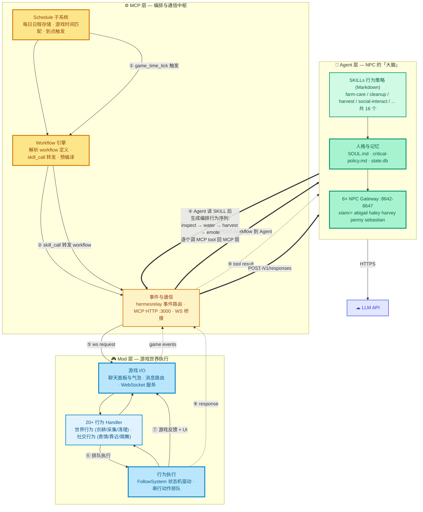
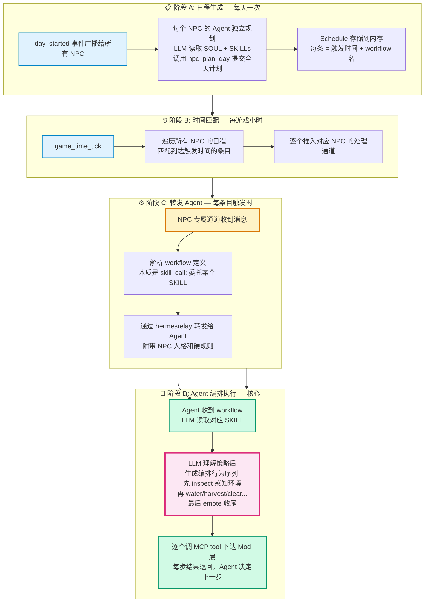
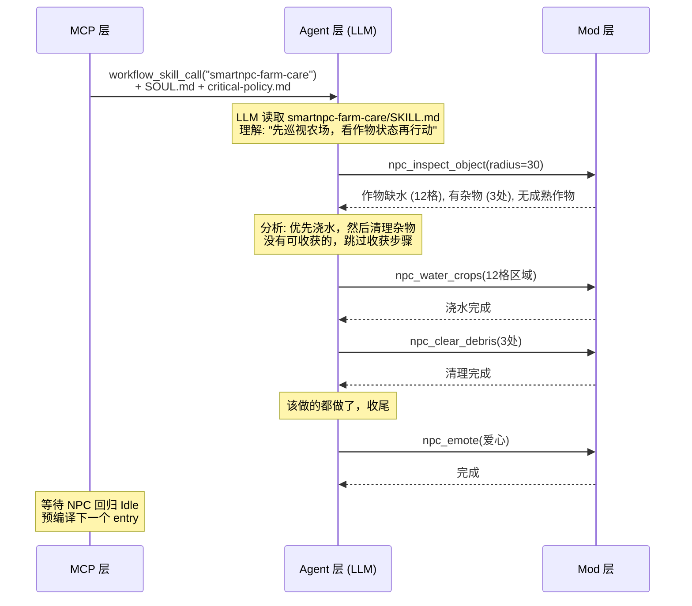

# SmartNPC 技术架构

> NPC Agent 自运转系统——LLM 驱动 NPC 人格与决策，确定性引擎编排执行，C# 模组桥接游戏世界。

---

## 1. 架构总览

### 三层架构与数据流



### 三层职能

| 层 | 角色 | 核心职责 |
|----|------|---------|
| **Agent 层** | NPC 的「大脑」 | 拥有人格和记忆，读取 SKILL 行为策略后自主决定做什么、怎么做——**行为编排的决策者** |
| **MCP 层** | 编排与通信中枢 | 管理日程时间表、到点触发 workflow、将 workflow 转发给 Agent、把 Agent 的工具调用下达到游戏——**消息的传递者** |
| **Mod 层** | 游戏世界执行 | 在游戏线程中操控 NPC 移动、使用工具、播放动画、更新 UI——**动作的执行者** |

### 两条驱动链路

| 链路 | 触发方式 | 流程 |
|------|---------|------|
| ⏰ **Schedule 时间驱动** | 游戏时间推进，到点自动触发 | `day_started` → LLM 规划全天日程 → 到点 workflow 转发给 Agent → Agent 编排行为 → Mod 执行 |
| 📡 **Event 事件驱动** | 玩家说话、点击 NPC、NPC 间消息 | 游戏事件 → MCP 层路由到对应 Agent → Agent 决定是否回应 → 调工具执行 |

### 核心设计原则

**Agent 层是行为编排的决策者。** MCP 层不预先编排步骤——它只做一件事：把当前 workflow 通过 `skill_call` 转发给 Agent。Agent 收到后读取 SKILL（行为策略文档），结合实时游戏状态，自行决定调用哪些工具、以什么顺序、传什么参数。每次工具调用的结果返回 Agent，供其决定下一步。MCP 层充当透明的消息通道，Mod 层忠实执行每个动作。

---

## 2. Schedule 自运转流程

NPC 的一天由 Schedule 驱动，从生成日程到执行完毕分为四个阶段：



**关键设计点：**

- `npc_plan_day` 每天只调一次 LLM——做日程框架（几点触发哪个 workflow）。不提前决定具体参数，留给触发时实时判断
- 每条 entry 触发时，workflow 转发给 Agent，Agent 读 SKILL 后**自行编排行为序列**——灵活适应实时游戏状态
- 同 NPC 串行执行——新触发自动取消旧任务，不会一个 NPC 同时做两件事
- 游戏切场景/跳帧不会丢失日程——匹配逻辑用"≤当前时间"而非"==精确时间"

---

## 3. 行为编排：Agent 如何决策

这是自运转系统最核心的环节。下面用一次具体的 Schedule 触发来说明。

### 3.1 触发链：从 Schedule 到 Agent

```
Scheduler 发现 7:00 到了 xiami 的 farm_care entry
  → Worker 解析 workflow 定义
    → 定义只有一个 step: skill_call("smartnpc-farm-care")
      → hermesrelay 将这个 skill_call 转发给 xiami 的 Agent
```

### 3.2 Agent 读 SKILL，生成行为序列

Agent 收到 `smartnpc-farm-care` 这个 SKILL 调用后：



**关键洞察：** SKILL.md 不是写死的步骤清单，而是**行为策略文档**——它告诉 LLM "你有哪些能力、在什么情况下该用哪个、有什么约束"。LLM 读完后根据**实时游戏状态**自行编排。同样是 `farm_care`，下雨天可能跳过浇水，收获季可能优先收割。

### 3.3 两种执行路径

| | 实时编排（默认） | 预编译（可选优化） |
|---|---|---|
| LLM 参与 | 每次触发均参与决策 | 仅预编译时参与，触发时零 LLM |
| 延迟 | 1–5 秒 | 毫秒级 |
| 适用场景 | 日常运行 | 重复性高、环境变化小的任务 |

预编译的原理：提前让 Agent 在"录制模式"下跑一遍 SKILL——读工具照常获取实时数据，写工具被拦截记录而非真执行。产生的步骤序列保存下来，触发时直接回放。

---

## 4. Mod 层：从指令到游戏动作

### 4.1 一个工具调用的旅程

当 Agent 决定 `npc_water_crops(某片区域)`，这个调用经过 MCP 层转发到 Mod 层后：

1. **路由**：根据工具名找到对应的 Handler（WaterCropsHandler）
2. **判断**：该 NPC 当前是否在忙？
   - 空闲 → 立即执行
   - 忙碌 → 排入该 NPC 的专属任务队列（FIFO），返回"已排队"告知 Agent
3. **执行**：Handler 扫描目标区域，找到所有需要浇水的格子，交给 FollowSystem
4. **驱动**：FollowSystem 每个游戏帧驱动 NPC 寻路到目标格 → 播放浇水动画 → 修改游戏状态 → 下一个格子
5. **收尾**：所有格子处理完毕，NPC 回归空闲，Agent 收到完成通知

### 4.2 三种任务模型

Mod 层按任务的执行特性分为三类：

| 模型 | 特征 | 典型行为 |
|------|------|---------|
| **即时** | 瞬间完成，不排队 | 头顶显示表情、聊天气泡、查看周围物体 |
| **独占** | 需要时间执行，同 NPC 串行排队 | 浇水、收割、清理杂物、耕地、播种 |
| **可打断** | 低优先级填充行为，新任务到达时被抢占 | 随意漫步 |

### 4.3 NPC 在游戏中的表现

Agent 驱动时 NPC 移速提升至 5 倍（正常行走的 2.5 倍），头顶显示当前执行的工作流标签。每个动作开始前显示简短气泡（如 `[water_crops]`），让玩家感知到 NPC 正在做什么。任务完成后 NPC 恢复常速，回归空闲。

---

## 5. 关键设计决策

- **Agent 编排，MCP 传递**：行为序列由 Agent 根据 SKILL + 实时游戏状态自主生成，MCP 层不做步骤编排，只负责转发和路由
- **日程与执行分离**：`npc_plan_day` 只定框架（几点做什么类型的事），具体参数和步骤留给触发时 Agent 实时决策——兼顾确定性和灵活性
- **每 NPC 独立并发**：各自的 goroutine + Agent profile 完全隔离，互不阻塞
- **游戏安全**：所有游戏状态操作在 SMAPI 游戏线程上执行，ws 接收线程只做消息分发

---

## 6. 相关文档

| 文档 | 内容 |
|------|------|
| [`npc-agent-autonomy.md`](npc-agent-autonomy.md) | 完整技术方案（系统详解、持久化、数据流） |
| [`development-guide.md`](development-guide.md) | 开发手册（新增行为/Workflow/Skill/Schedule 全流程） |
| [`startup-guide.md`](startup-guide.md) | 启动手册（环境安装→手动分步→一键启动→排查） |
| [`architecture.md`](architecture.md) | Hermes-first 架构背景与 ADR 设计取舍 |
