## Markdown Viewer Skills

#### 概述

让 agent 直接用 Markdown 代码块创建精美图表和可视化。

- **GitHub**: [markdown-viewer/skills](https://github.com/markdown-viewer/skills)

---

#### 快速选型指南

| 需求 | Skill | 代码块 | 说明 |
|------|-------|--------|------|
| 系统分层架构 | `architecture` | 内嵌 HTML | 颜色分层模板，12 种风格 |
| 模块结构梳理 | `mindmap` | ` ```plantuml ` | 放射状思维导图 |
| API 调用链 / 状态机 | `uml` | ` ```plantuml ` | 14 种 UML 图 + 9500 图标 |
| 业务决策流程 | `bpmn` | ` ```plantuml ` | BPMN 标准 + EIP 集成模式 |
| 模块依赖关系 | `graphviz` | ` ```dot ` | DOT 自动布局 + cluster |
| 统计图表 | `vega` | ` ```vega-lite ` | 声明式 JSON（bar/line/scatter） |
| 人物档案 / 摘要卡 | `infocard` | 内嵌 HTML | 29 种杂志级风格模板 |
| 网络拓扑 | `network` | ` ```plantuml ` | Cisco/通用设备图标 |
| 自由布局概念图 | `canvas` | ` ```canvas ` | JSON 坐标，Obsidian 兼容 |
| 快速看板 / 清单 | `infographic` | ` ```infographic ` | 声明式 DSL，40+ 模板 |
| 安全信任域 | `security` | ` ```plantuml ` | IAM/加密/防火墙图标 |
| ETL / 数据管线 | `data-analytics` | ` ```plantuml ` | AWS 风格流处理图标 |
| 云部署架构 | `cloud` | ` ```plantuml ` | AWS/Azure/GCP stdlib 图标 |

---

#### 效果

##### 1. Architecture — 分层系统架构图

用 HTML/CSS 模板生成带颜色分层的系统拓扑图。蓝=用户层、黄=桥接层、绿=AI 层、紫=基础设施。

<details>
<summary>SmartNPC System Architecture</summary>

<div style="width: 1200px; box-sizing: border-box; position: relative; background: #fafbfc; padding: 20px; border-radius: 6px; border: 1px solid #e5e7eb;">
  <style scoped>
    .arch-wrapper { display: flex; gap: 12px; }.arch-sidebar { width: 165px; flex-shrink: 0; }.arch-main { flex: 1; min-width: 0; }.arch-title { text-align: center; font-size: 22px; font-weight: bold; color: #1f2937; margin-bottom: 16px; }
    .arch-layer { margin: 8px 0; padding: 14px; border-radius: 6px; box-shadow: 0 1px 3px rgba(0, 0, 0, 0.04); }.arch-layer-title { font-size: 13px; font-weight: bold; margin-bottom: 10px; text-align: center; }
    .arch-grid { display: grid; gap: 8px; }.arch-grid-2 { grid-template-columns: repeat(2, 1fr); }.arch-grid-3 { grid-template-columns: repeat(3, 1fr); }.arch-grid-4 { grid-template-columns: repeat(4, 1fr); }.arch-grid-5 { grid-template-columns: repeat(5, 1fr); }.arch-grid-6 { grid-template-columns: repeat(6, 1fr); }
    .arch-box { border-radius: 4px; padding: 8px; text-align: center; font-size: 11px; font-weight: 600; line-height: 1.35; color: #1f2937; background: #ffffff; border: 1px solid #e5e7eb; }.arch-box.highlight { background: #f3f4f6; border: 2px solid #3b82f6; color: #1d4ed8; }.arch-box.tech { font-size: 10px; color: #6b7280; background: #f9fafb; }
    .arch-layer.external { background: linear-gradient(135deg, #f9fafb 0%, #f3f4f6 100%); border: 1px dashed #d1d5db; }.arch-layer.external .arch-layer-title { color: #6b7280; }.arch-layer.user { background: linear-gradient(135deg, #eff6ff 0%, #dbeafe 100%); border: 2px solid #3b82f6; }.arch-layer.user .arch-layer-title { color: #1d4ed8; }.arch-layer.application { background: linear-gradient(135deg, #fffbeb 0%, #fef3c7 100%); border: 2px solid #d97706; }.arch-layer.application .arch-layer-title { color: #92400e; }.arch-layer.ai { background: linear-gradient(135deg, #f0fdf4 0%, #dcfce7 100%); border: 2px solid #16a34a; }.arch-layer.ai .arch-layer-title { color: #15803d; }.arch-layer.infra { background: linear-gradient(135deg, #f5f3ff 0%, #ede9fe 100%); border: 2px solid #7c3aed; }.arch-layer.infra .arch-layer-title { color: #5b21b6; }
    .arch-sidebar-panel { border-radius: 6px; padding: 10px; background: linear-gradient(135deg, #f3f4f6 0%, #e5e7eb 100%); border: 1px solid #d1d5db; margin-bottom: 8px; }.arch-sidebar-title { font-size: 12px; font-weight: bold; text-align: center; color: #1f2937; margin-bottom: 6px; }.arch-sidebar-item { font-size: 10px; text-align: center; color: #374151; background: #ffffff; padding: 5px; border-radius: 3px; margin: 3px 0; border: 1px solid #e5e7eb; }.arch-sidebar-item.metric { background: #f0fdf4; border: 1px solid #16a34a; color: #15803d; font-weight: 600; }
  </style>
  <div class="arch-title">SmartNPC System Architecture</div>
  <div class="arch-wrapper">
    <div class="arch-sidebar">
      <div class="arch-sidebar-panel"><div class="arch-sidebar-title">Ports</div><div class="arch-sidebar-item metric">ws :18745</div><div class="arch-sidebar-item metric">http :3000</div><div class="arch-sidebar-item metric">gw :8642-8647</div></div>
      <div class="arch-sidebar-panel"><div class="arch-sidebar-title">Observability</div><div class="arch-sidebar-item">Langfuse</div><div class="arch-sidebar-item">slog Debug</div><div class="arch-sidebar-item">Health Check</div></div>
      <div class="arch-sidebar-panel"><div class="arch-sidebar-title">Dev Tools</div><div class="arch-sidebar-item">Taskfile</div><div class="arch-sidebar-item">Echo Mode</div><div class="arch-sidebar-item">CI Pipeline</div></div>
    </div>
    <div class="arch-main">
      <div class="arch-layer user">
        <div class="arch-layer-title">Game Layer (C# .NET 6)</div>
        <div class="arch-grid arch-grid-4"><div class="arch-box highlight">SMAPI Mod<br><small>StardewModdingAPI</small></div><div class="arch-box">Chat UI<br><small>Tab / F2 Panel</small></div><div class="arch-box">NPC Router<br><small>AudibleNPCResolver</small></div><div class="arch-box">WebSocket Server<br><small>:18745</small></div></div>
      </div>
      <div class="arch-layer application">
        <div class="arch-layer-title">Bridge Layer (Go 1.25)</div>
        <div class="arch-grid arch-grid-4"><div class="arch-box highlight">smartnpc-mcp<br><small>MCP Server</small></div><div class="arch-box">pkg/agentbridge<br><small>Framework Core</small></div><div class="arch-box">adapters/stardew<br><small>SDV Adapter</small></div><div class="arch-box">hermesrelay<br><small>Event Router</small></div></div>
      </div>
      <div class="arch-layer ai">
        <div class="arch-layer-title">Agent Layer (Hermes Profiles)</div>
        <div class="arch-grid arch-grid-6"><div class="arch-box">xiami<br><small>:8642</small></div><div class="arch-box">abigail<br><small>:8643</small></div><div class="arch-box">haley<br><small>:8644</small></div><div class="arch-box">harvey<br><small>:8645</small></div><div class="arch-box">penny<br><small>:8646</small></div><div class="arch-box">sebastian<br><small>:8647</small></div></div>
      </div>
      <div class="arch-layer infra">
        <div class="arch-layer-title">Infrastructure</div>
        <div class="arch-grid arch-grid-4"><div class="arch-box tech">Hermes Gateway<br><small>/v1/responses</small></div><div class="arch-box tech">Docker Compose<br><small>deploy/hermes/</small></div><div class="arch-box tech">Langfuse<br><small>Tracing</small></div><div class="arch-box tech">WSL2<br><small>Linux Runtime</small></div></div>
      </div>
      <div class="arch-layer external">
        <div class="arch-layer-title">External Dependencies</div>
        <div class="arch-grid arch-grid-3"><div class="arch-box tech">Stardew Valley<br><small>Game Runtime</small></div><div class="arch-box tech">OpenAI-compatible LLM<br><small>via Gateway</small></div><div class="arch-box tech">MCP Protocol<br><small>Streamable HTTP</small></div></div>
      </div>
    </div>
    <div class="arch-sidebar">
      <div class="arch-sidebar-panel"><div class="arch-sidebar-title">NPC Features</div><div class="arch-sidebar-item">SOUL Personality</div><div class="arch-sidebar-item">Memory Policy</div><div class="arch-sidebar-item">Cron Recipes</div><div class="arch-sidebar-item">Proactive Greeting</div></div>
      <div class="arch-sidebar-panel"><div class="arch-sidebar-title">MCP Tools</div><div class="arch-sidebar-item">chat_say</div><div class="arch-sidebar-item">npc_movement</div><div class="arch-sidebar-item">game_query</div><div class="arch-sidebar-item">mail_send</div></div>
      <div class="arch-sidebar-panel"><div class="arch-sidebar-title">Events</div><div class="arch-sidebar-item">chat_message</div><div class="arch-sidebar-item">npc_interact</div><div class="arch-sidebar-item">group_create</div></div>
    </div>
  </div>
</div>

</details>

---

##### 2. Mind Map — 项目模块结构脑图

PlantUML `@startmindmap` + `left side` 分侧 + `<style>` 层级颜色。

<details>
<summary>SmartNPC 项目模块结构</summary>

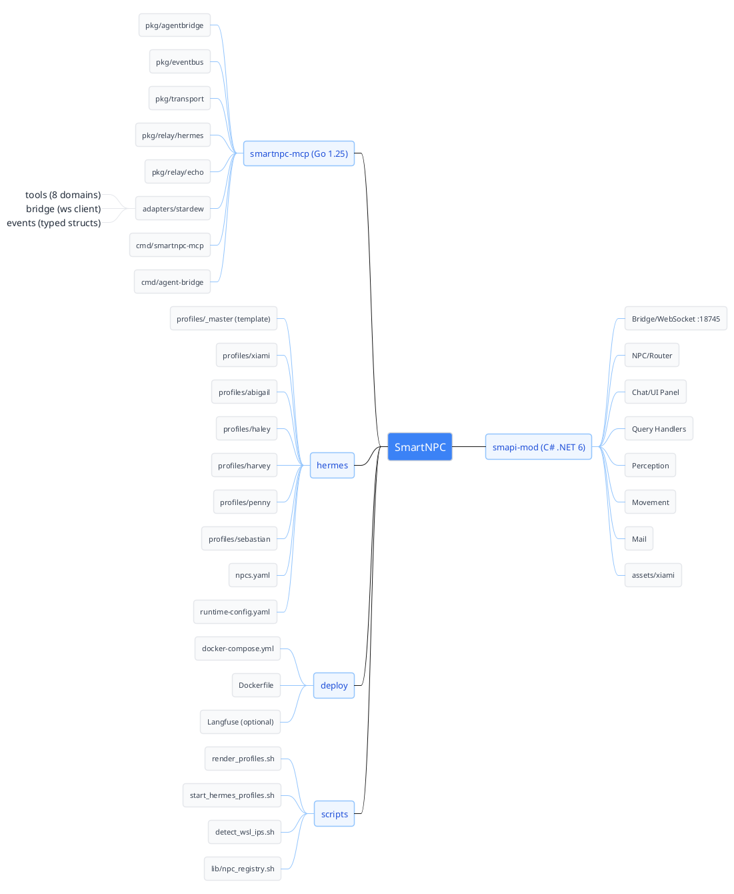

</details>

---

##### 3. UML Sequence — 聊天消息流时序图

展示 Player → Mod → MCP → Hermes → Agent → tool_call → Game 完整链路。

<details>
<summary>玩家聊天 → Hermes → chat_say 完整链路</summary>

```plantuml
@startuml
skinparam backgroundColor #fafbfc
skinparam sequence {
  ArrowColor #3b82f6
  LifeLineBorderColor #d1d5db
  LifeLineBackgroundColor #f3f4f6
  ParticipantBorderColor #9ca3af
  ParticipantBackgroundColor #ffffff
  ParticipantFontColor #1f2937
}
skinparam note { BackgroundColor #fffbeb; BorderColor #d97706; FontColor #92400e }

actor "Player" as P #3b82f6
participant "SMAPI Mod\n(C# ws:18745)" as Mod #ffffff
participant "smartnpc-mcp\n(Go :3000)" as MCP #ffffff
participant "hermesrelay" as Relay #ffffff
participant "Hermes Gateway" as GW #ffffff
participant "Profile: xiami\n(:8642)" as Agent #f0fdf4

P -> Mod : Tab -> type message
activate Mod
Mod -> MCP : ws event\n{type: "event", kind: "chat_message"}
activate MCP

MCP -> Relay : route event by NPC target
activate Relay
Relay -> GW : POST /v1/responses\n{input: formatted_event}
activate GW

GW -> Agent : trigger with SOUL + context
activate Agent

note right of Agent : Agent decides to reply\nusing MCP tool

Agent -> MCP : MCP tool_call: chat_say\n{npc: "xiami", text: "..."}
activate MCP #dcfce7
MCP -> Mod : ws request\n{action: "chat_say", ...}
Mod -> P : NPC speech bubble appears
deactivate MCP

Agent --> GW : response complete
deactivate Agent
deactivate GW
deactivate Relay
deactivate MCP
deactivate Mod
@enduml
```

</details>

---

##### 4. Infographic — 声明式信息图表

一个 data block 即一张图，支持时间线、层级树、Checklist、对比等 40+ 模板。

<details>
<summary>代码架构层级树</summary>

```infographic
infographic hierarchy-tree-tech-style-capsule-item
data
  title SmartNPC Code Architecture
  items
    - label SmartNPC (monorepo)
      children
        - label smartnpc-mcp (Go)
          children
            - label pkg/ (framework)
            - label adapters/ (game-specific)
            - label cmd/ (entry points)
        - label smapi-mod (C#)
          children
            - label Bridge/ (ws protocol)
            - label NPC/ (routing)
            - label Chat/ (UI)
        - label hermes/ (agent config)
          children
            - label profiles/ (6 NPCs)
            - label npcs.yaml (registry)
```

</details>

---

##### 5. Graphviz — 模块依赖图

DOT 语言 + `subgraph cluster` 分组 + 跨层连线颜色标注。

<details>
<summary>SmartNPC 跨层模块依赖</summary>

```dot
digraph SmartNPC_Dependencies {
    rankdir=TB;
    bgcolor="#fafbfc";
    node [shape=box, style="filled,rounded", fillcolor="#ffffff", fontcolor="#1f2937", color="#d1d5db", fontsize=11];
    edge [color="#9ca3af", fontcolor="#6b7280", fontsize=9];

    subgraph cluster_game {
        label="Game Layer"; fontcolor="#1d4ed8"; color="#3b82f6"; style=dashed; bgcolor="#eff6ff";
        smapi_mod [label="smapi-mod\n(C# .NET 6)", fillcolor="#dbeafe", color="#3b82f6"];
        sdv_dll [label="StardewValley.dll", shape=component, fillcolor="#f9fafb"];
        smapi_api [label="SMAPI API", shape=component, fillcolor="#f9fafb"];
        harmony [label="Harmony", shape=component, fillcolor="#f9fafb"];
    }

    subgraph cluster_bridge {
        label="Bridge Layer"; fontcolor="#92400e"; color="#d97706"; style=dashed; bgcolor="#fffbeb";
        mcp_server [label="smartnpc-mcp\n(Go)", fillcolor="#fef3c7", color="#d97706"];
        agentbridge [label="pkg/agentbridge", fillcolor="#ffffff"];
        eventbus [label="pkg/eventbus", fillcolor="#ffffff"];
        relay_hermes [label="pkg/relay/hermes", fillcolor="#ffffff"];
        adapter [label="adapters/stardew", fillcolor="#ffffff"];
        tools [label="adapters/stardew/tools", fillcolor="#ffffff"];
        bridge_ws [label="adapters/stardew/bridge", fillcolor="#ffffff"];
    }

    subgraph cluster_agent {
        label="Agent Layer"; fontcolor="#15803d"; color="#16a34a"; style=dashed; bgcolor="#f0fdf4";
        master [label="profiles/_master\n(template)", fillcolor="#dcfce7", color="#16a34a"];
        xiami [label="xiami", fillcolor="#ffffff"];
        abigail [label="abigail", fillcolor="#ffffff"];
        haley [label="haley", fillcolor="#ffffff"];
        harvey [label="harvey", fillcolor="#ffffff"];
        penny [label="penny", fillcolor="#ffffff"];
        sebastian [label="sebastian", fillcolor="#ffffff"];
        runtime_cfg [label="runtime-config.yaml", shape=note, fillcolor="#f9fafb"];
    }

    subgraph cluster_ext {
        label="External"; fontcolor="#6b7280"; color="#9ca3af"; style=dashed; bgcolor="#f9fafb";
        mcp_sdk [label="mcp-go SDK", shape=component, fillcolor="#f3f4f6"];
        go_ws [label="gorilla/websocket", shape=component, fillcolor="#f3f4f6"];
    }

    smapi_mod -> sdv_dll;
    smapi_mod -> smapi_api;
    smapi_mod -> harmony;

    mcp_server -> mcp_sdk;
    mcp_server -> go_ws;
    mcp_server -> agentbridge;
    agentbridge -> eventbus;
    adapter -> agentbridge [label="implements"];
    tools -> bridge_ws [label="uses"];
    relay_hermes -> eventbus [label="subscribes"];

    master -> xiami [label="renders"];
    master -> abigail [label="renders"];
    master -> haley [label="renders"];
    master -> harvey [label="renders"];
    master -> penny [label="renders"];
    master -> sebastian [label="renders"];

    runtime_cfg -> xiami [style=dashed];
    runtime_cfg -> abigail [style=dashed];
    runtime_cfg -> haley [style=dashed];
    runtime_cfg -> harvey [style=dashed];
    runtime_cfg -> penny [style=dashed];
    runtime_cfg -> sebastian [style=dashed];

    smapi_mod -> mcp_server [label="ws :18745", color="#3b82f6"];
    mcp_server -> xiami [label="hermesrelay", color="#16a34a"];
}
```

</details>

---

##### 6. BPMN — NPC 决策流程

BPMN 事件/网关 + EIP 路由图标，描述"感知→评估→决策→执行"循环。

<details>
<summary>NPC 消息路由 → LLM → 工具选择</summary>

```plantuml
@startuml
left to right direction

mxgraph.bpmn.event.messageStart "Player\nMessage" as start
rectangle "SMAPI Mod\nReceive" as recv
rectangle "Emit WS\nEvent" as emit
rectangle "smartnpc-mcp\nRoute" as route
mxgraph.eip.content_based_router "Target\nNPC?" as router
rectangle "Hermes Agent\nEvaluate Context" as eval
mxgraph.bpmn.gateway2.exclusive "Reply\nNeeded?" as gw

rectangle "chat_say" as chat
rectangle "npc_movement" as move
rectangle "mail_send" as mail
mxgraph.bpmn.gateway2.parallel "Choose\nTool" as tools

rectangle "Execute via\nMCP" as exec
rectangle "Log &\nIdle" as idle
mxgraph.bpmn.event.end "Done" as end1
mxgraph.bpmn.event.end "Done" as end2

start --> recv
recv --> emit
emit --> route
route --> router
router --> eval : "xiami / abigail / ..."
eval --> gw

gw --> tools : "Yes"
gw --> idle : "No"

tools --> chat
tools --> move
tools --> mail

chat --> exec
move --> exec
mail --> exec
exec --> end1
idle --> end2
@enduml
```

</details>

---

#### 7. Data-Analytics — 事件处理管线

AWS 风格图标绘制游戏事件流处理架构。

<details>
<summary>游戏事件 → Agent → 状态更新</summary>

```plantuml
@startuml
left to right direction

rectangle "Game Events\n(Source)" {
  mxgraph.aws4.kinesis_data_streams "chat_message" as e1
  mxgraph.aws4.kinesis_data_streams "npc_interact" as e2
  mxgraph.aws4.kinesis_data_streams "group_create" as e3
}

mxgraph.aws4.msk "EventBus\n(pkg/eventbus)" as bus

mxgraph.aws4.glue "Event Router\n(content-based)" as router

rectangle "Hermes Agents\n(LLM Processing)" {
  mxgraph.aws4.emr_engine "xiami\nAgent" as a1
  mxgraph.aws4.emr_engine "abigail\nAgent" as a2
  mxgraph.aws4.emr_engine "others\n..." as a3
}

mxgraph.aws4.kinesis_data_firehose "Tool Calls\n(MCP)" as tools

mxgraph.aws4.dynamodb "Game State\nUpdate" as state

mxgraph.aws4.quicksight "Langfuse\n(Traces)" as langfuse

e1 --> bus
e2 --> bus
e3 --> bus
bus --> router
router --> a1 : "target: xiami"
router --> a2 : "target: abigail"
router --> a3 : "target: ..."

a1 --> tools
a2 --> tools
a3 --> tools
tools --> state

a1 ..> langfuse
a2 ..> langfuse
a3 ..> langfuse
router ..> langfuse
@enduml
```

</details>

---

## Architecture Diagram Generator

生成独立暗色主题 HTML+SVG 架构图，自带 PNG/PDF/剪贴板导出，浏览器直接打开。

- **GitHub**: [Cocoon-AI/architecture-diagram-generator](https://github.com/Cocoon-AI/architecture-diagram-generator)

#### 与 Markdown Viewer `architecture` 的区别

| | `architecture`（Markdown 内嵌） | `architecture-diagram`（独立 HTML） |
|---|---|---|
| 输出 | 嵌入 Markdown，预览中渲染 | 独立 .html 文件，浏览器打开 |
| 主题 | 12 种风格可选 | 固定暗色 `#020617` |
| 导出 | 依赖 Markdown Viewer 扩展 | 自带 PNG/PDF/剪贴板按钮 |
| 适合 | 文档内嵌、PR 描述 | 独立交付、演示分享 |

#### 效果

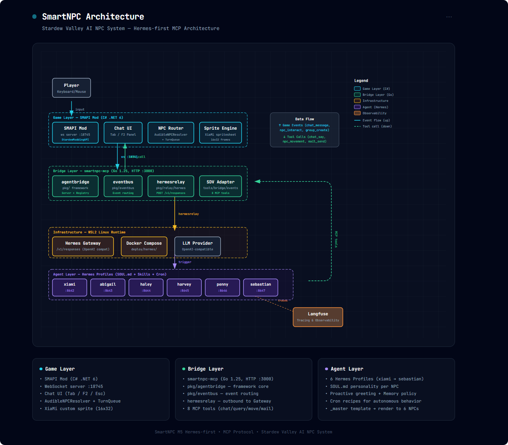

---

## MarkItDown

微软开源的文件转 Markdown 工具，让 agent 能"阅读"几乎所有非纯文本文件。

- **GitHub**: [microsoft/markitdown](https://github.com/microsoft/markitdown)

#### 支持格式与 Agent 价值

| 格式 | 转换效果 | Agent 场景 |
|------|---------|-----------|
| PDF / Word / PPT | 提取文本，保留标题/列表/表格结构 | 阅读需求文档、生成摘要 |
| Excel / CSV | 转为 Markdown 表格 | 数据分析、引用计算 |
| HTML | 清洗为干净 Markdown | 网页内容提取，去噪 |
| 图片 / 音频 | OCR / 语音转文字 | 截图识别、会议记录 |
| ZIP | 递归处理内部文件 | 批量文档转换 |

#### 与 skills 的协作流程

```infographic
infographic sequence-snake-steps-simple
data
  title MarkItDown + Skills 协作流程
  items
    - label 获取外部文档
      desc PDF / DOCX / PPTX / XLSX
      icon mdi/file-document-outline
    - label MarkItDown 转换
      desc 二进制 → 干净 Markdown
      icon mdi/swap-horizontal
    - label Agent 理解
      desc 提取结构、关键信息
      icon mdi/brain
    - label Skills 生成图表
      desc architecture / uml / infographic
      icon mdi/chart-box-outline
    - label Markdown Viewer 渲染
      desc 实时预览
      icon mdi/eye-outline
```

---
	
## oh-my-mermaid

架构扫描与文档生成工具，通过**视角驱动递归分析**自动生成 `.omm/` 架构文档。

- **GitHub**: [oh-my-mermaid](https://github.com/nicepkg/oh-my-mermaid) | **安装**: `npm install -g oh-my-mermaid`

#### 核心能力

| 能力 | 说明 |
|------|------|
| **视角驱动分析** | 从多个视角审视代码库，每个视角回答一类架构问题 |
| **递归钻取** | 图中每个元素自动分析内部结构——有子组件则递归出子图，无则止于叶子节点 |
| **文件系统即导航** | 元素 ID 与子目录名一致，`omm view` 自动解析层级，无需手写索引 |
| **结构化字段** | 每个元素 6 个字段：description / context / constraint / concern / todo / note |

#### 视角目录

| 视角 | 适用场景 |
|------|---------|
| `overall-architecture` | 系统全局拓扑，必选 |
| `request-lifecycle` | 服务/API 的请求端到端链路 |
| `data-flow` | 数据从哪来、如何变换、到哪去 |
| `dependency-map` | 模块依赖关系、共享层 |
| `external-integrations` | 外部 API/服务拓扑 |
| `state-transitions` | 状态机与状态流转 |
| `command-surface` | CLI 工具的命令树与分发 |
| `orchestration` | 事件驱动系统的发布/订阅拓扑 |
| `pipeline` | ML/数据管线的阶段拓扑 |

#### 使用方式

```bash
# 扫描代码库，生成 .omm/ 架构文档
/oh-my-mermaid:omm-scan

# 在浏览器中查看生成的架构图
omm view

# 将 .omm/ 推送到 ohmymermaid.cn 在线分享
/oh-my-mermaid:omm-push
```

#### 与 Markdown Viewer `architecture` 的区别

| | `architecture`（Markdown 内嵌） | oh-my-mermaid（递归扫描） |
|---|---|---|
| 生成方式 | 手动编写 HTML/Mermaid | 自动扫描代码库，agent 递归生成 |
| 颗粒度 | 一张总览图 | 多视角 + 多层子图，层层钻取 |
| 维护 | 代码变动需手动同步 | 重新扫描即可刷新 |
| 输出 | 嵌入 Markdown 的代码块 | `.omm/` 目录树，每个元素一个子目录 |
| 适合 | 一页讲清全局，文档插图 | 完整架构知识库，持续维护 |

#### 效果

扫描 SmartNPC 代码库后生成的架构层级视图：

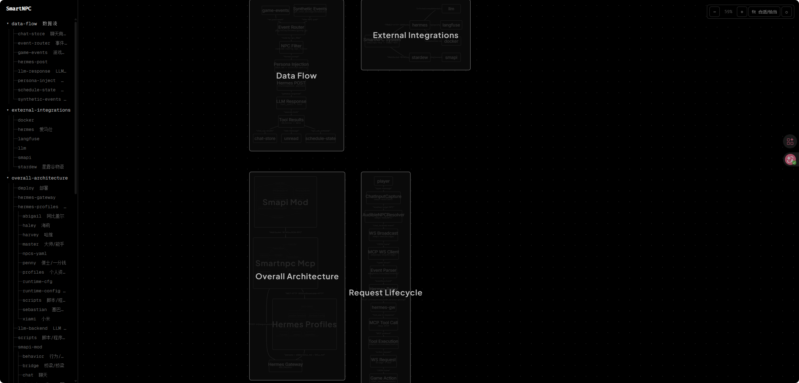

模块内部的组件展开：

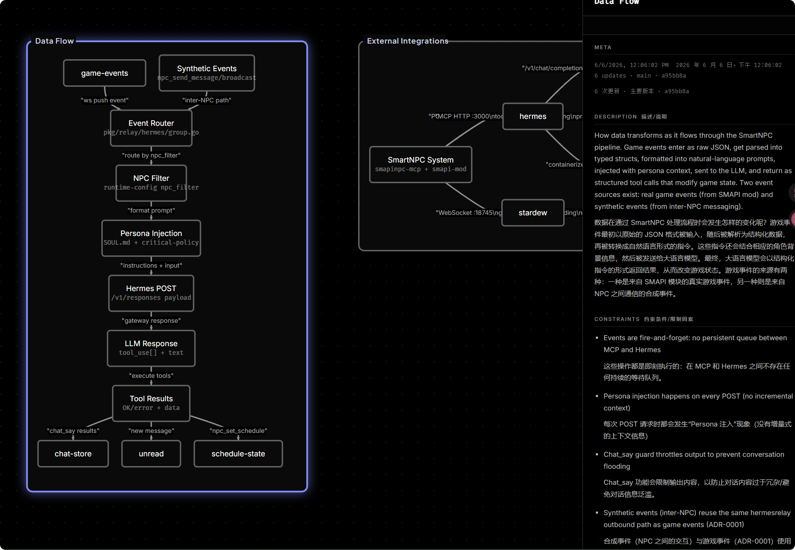

叶子节点——单文件/简单组件：

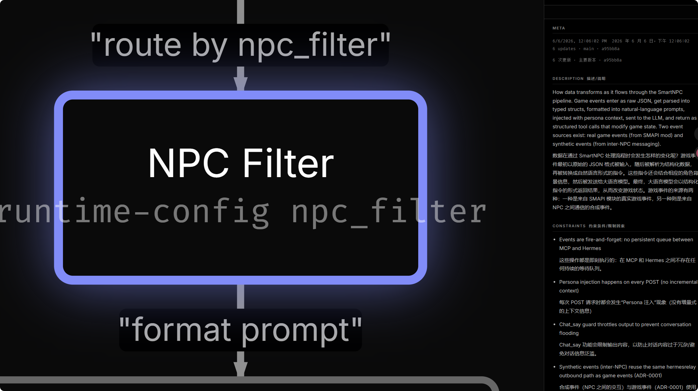

---

## Excalidraw Diagram Generator

直接生成 `.excalidraw` JSON 文件——手绘风格架构图，支持多种布局模式和自定义配色。

- **来源**: `ccc-skills@ccc` 插件中的 `excalidraw` skill


#### 核心能力

| 能力 | 说明 |
|------|------|
| **代码分析 → 自动出图** | 扫描项目结构，自动识别组件/服务/数据库/API，生成对应架构图 |
| **多种布局模式** | Vertical Flow / Horizontal Pipeline / Hub-and-Spoke / Complex Grid |
| **自定义配色** | 内置 Default/AWS/Azure/GCP/K8s 配色，支持自定义（如莫奈色系） |
| **3 种字体** | Virgil（手写）/ Helvetica（无衬线）/ Cascadia（等宽） |
| **PNG/SVG 导出** | 通过 Playwright MCP 程序化渲染为图片（无需手动上传网站） |
| **虚线分组框** | 逻辑分组，支持不同透明度层次 |
| **肘形/曲线箭头** | 90° 肘形连接 + 曲线放射状连接 |
| **多字体混排** | 标题用手写风，代码路径用等宽 Cascadia |

#### 布局模式对照

| 布局 | 适用场景 | 示例文件 |
|------|---------|---------|
| Vertical Flow | 分层架构（用户→前端→服务→数据） | `system-architecture.excalidraw` |
| Horizontal Pipeline | 请求链路、CI/CD、数据管线 | `request-lifecycle.excalidraw` |
| Hub-and-Spoke | 中心路由、MCP 工具注册、事件分发 | `mcp-tools-map.excalidraw` |
| Vertical + Groups | 模板渲染、配置关系 | `hermes-profile-system.excalidraw` |
| Complex Grid | 密集模块分解、domain 并排 | `smapi-mod-internals.excalidraw` |

#### 使用方式

```
"Generate an architecture diagram for this project"
"Create an excalidraw diagram of the system"
"用莫奈配色生成架构图"
```

#### 与其他 skill 的区别

| | `architecture`（HTML 内嵌） | `excalidraw`（.excalidraw JSON） | `oh-my-mermaid`（递归文档） |
|---|---|---|---|
| 输出格式 | 嵌入 Markdown 的 HTML | 独立 `.excalidraw` 文件 | `.omm/` 目录树 + Mermaid |
| 视觉风格 | CSS 模板分层 | 手绘风格，可自定义配色 | 标准 Mermaid 渲染 |
| 编辑方式 | 改 HTML 源码 | VS Code 扩展 / excalidraw.com 拖拽 | CLI `omm write` |
| 适合 | 文档内嵌、PR 描述 | 独立交付、可拖拽编辑、演示 | 完整架构知识库、持续维护 |
| 导出 | 依赖 Markdown Viewer 渲染 | 内建 PNG/SVG 导出 | `omm push` 在线分享 |
| 交互性 | 静态渲染 | 可缩放/拖动/编辑 | 浏览器层级导航 |


#### 生成产物

本项目已生成 5 张 Excalidraw 架构图，位于 `docs/architecture/`：

| 文件 | 布局 | 内容 |
|------|------|------|
| `system-architecture.excalidraw` | Vertical Flow | 系统总览（3 层 + LLM + 图例） |
| `request-lifecycle.excalidraw` | Horizontal Pipeline | 聊天请求 10 步全链路 + 时序标注 |
| `mcp-tools-map.excalidraw` | Hub-and-Spoke | 15+ MCP 工具按域放射分类 |
| `hermes-profile-system.excalidraw` | Vertical + Groups | 模板渲染流程 + 占位符说明 |
| `smapi-mod-internals.excalidraw` | Complex Grid | Mod 内部 4 层模块分解 |

#### 效果

##### 1. System Architecture — Vertical Flow（分层 + 分组框 + 图例）

系统总览：3 层架构（Game → MCP → Hermes）+ 外部 LLM + 底部莫奈配色图例。

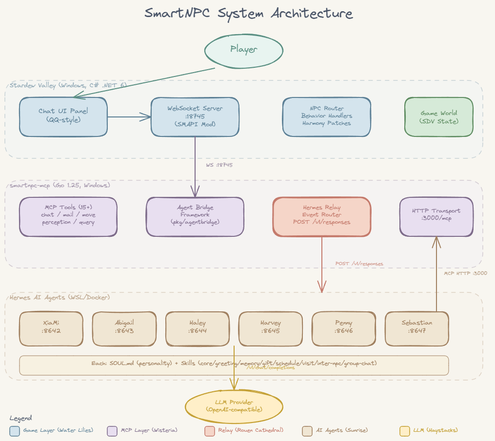

---

##### 2. Request Lifecycle — Horizontal Pipeline（双行管道 + 序号 + 时序标注）

玩家聊天请求 10 步全链路：上行（①→⑥）+ 下行返回路径（⑦→⑩）+ 时序注释。

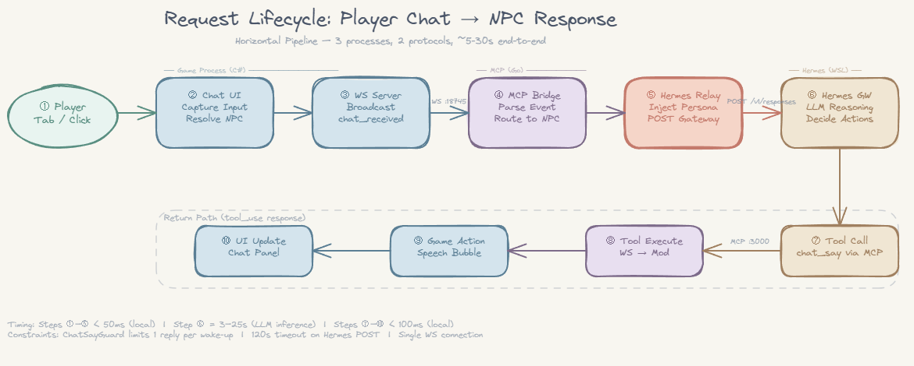

---

##### 3. MCP Tools Map — Hub-and-Spoke（放射状连接 + 曲线箭头 + 域着色）

15+ MCP 工具按域分类：Chat / Mail / Query / Perception / Movement / Behavior / Schedule / Inter-NPC / Meta。

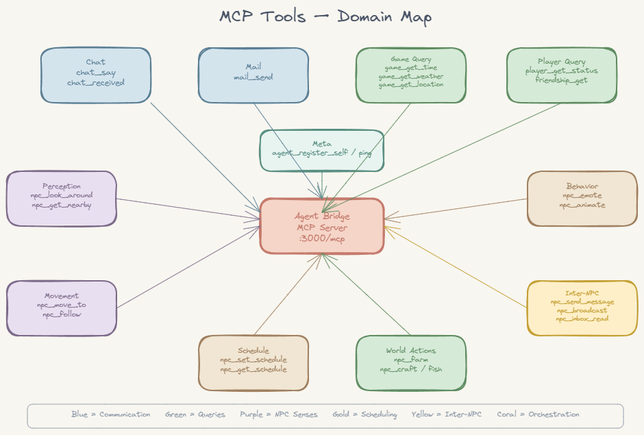

---

##### 4. Hermes Profile System — Vertical + Groups（模板关系 + 占位符 + 等宽字体混排）

`_master/` 模板 → `render_profiles.sh` 占位符展开 → 6 个 NPC 渲染产物。

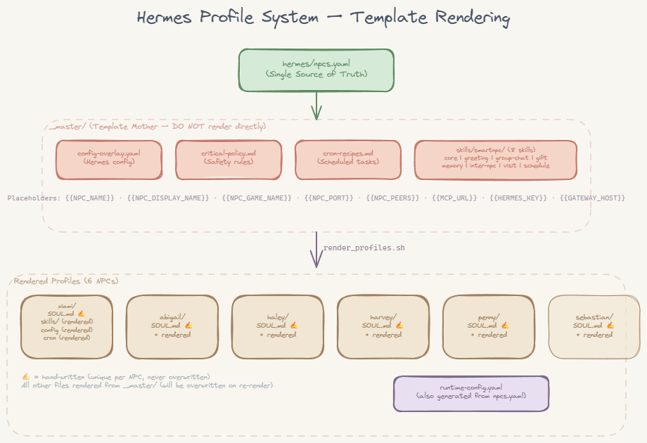

---

##### 5. SMAPI Mod Internals — Complex Grid（密集嵌套分组 + 多域并排）

Mod 内部 4 层模块分解：Bridge/ → UI/ → NPC/ → Domain Handlers → Data/。

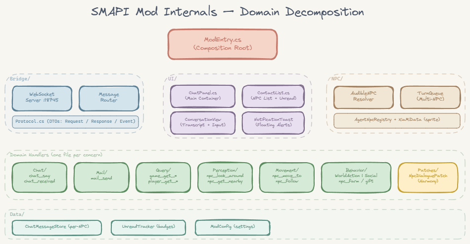


