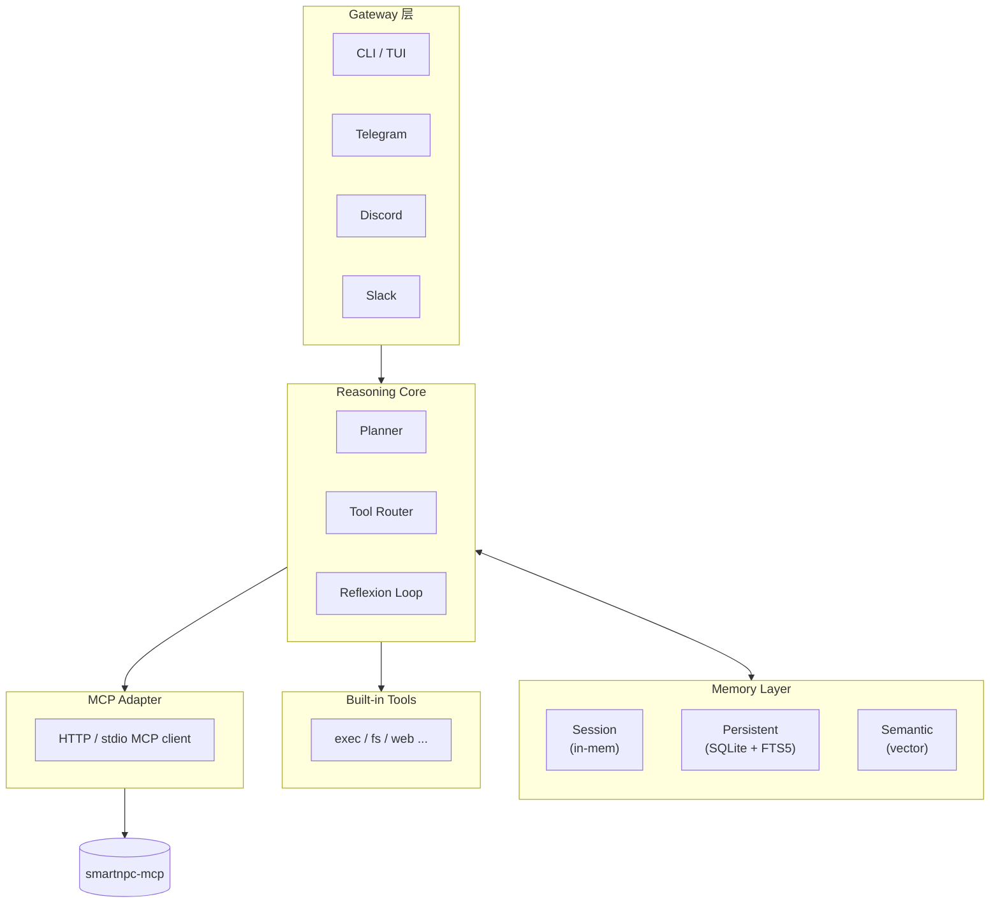
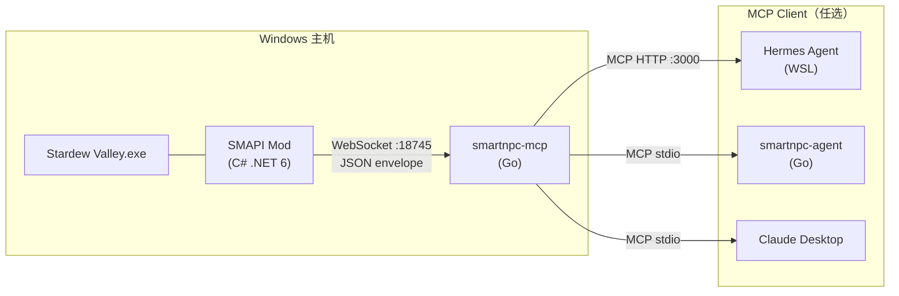

# 周报 · 2026-04-30

## 一、Hermes Agent 调研

Hermes Agent 是一个本地优先的 AI Agent 框架。它的重点不是单次问答，而是让 Agent 在使用过程中持续学习：记住重要信息、总结做事方法，并把常用流程沉淀成 skill。

### 1. 产品形态

| 维度 | 说明 |
|------|------|
| 运行方式 | 通过 `hermes` CLI 启动，本地保存配置和数据 |
| 模型接入 | 支持 OpenAI 兼容接口，可接自定义模型服务 |
| 主要入口 | 终端 TUI，也可接 Telegram、Discord、Slack 等平台 |
| 能力扩展 | 通过内置工具、skill 文件和 MCP server 扩展能力 |

### 2. 核心能力

| 能力 | 说明 |
|------|------|
| 学习循环 | 任务结束后自动复盘，判断哪些信息要记住、哪些流程要沉淀成 skill |
| 三层记忆 | 短期会话记忆、长期事件记忆、稳定语义记忆 |
| Skill 系统 | 每个 skill 是一个 md 文件，用来描述"怎么做事"；后续可以继续优化 |
| 工具系统 | 内置执行、搜索、文件、记忆等工具；也能通过 MCP 接外部应用 |
| 多平台接入 | 可通过不同 Gateway 接入聊天平台，把 Agent 放进日常协作流 |

### 3. 内部架构

简单理解：Gateway 负责接收消息，Core 负责思考和调度工具，Memory 负责记忆，Tools / MCP 负责连接外部能力。

### 4. 学习闭环

| 步骤 | 作用 |
|------|------|
| 记忆筛选 | 任务结束后判断哪些信息值得长期保存 |
| 创建 Skill | 遇到重复任务时，把成功流程写成 skill |
| 优化 Skill | 如果 skill 使用效果不好，就补充或修改已有步骤 |
| 检索记忆 | 新任务开始前，从历史记录中找相关信息 |
| 用户建模 | 长期观察用户偏好，例如沟通风格、目标、做事习惯 |

这套机制的价值在于：Agent 不只是被动执行命令，而是会逐步形成自己的"工作手册"。

### 5. 三层记忆

| 层级 | 记什么 | 用途 |
|------|--------|------|
| 会话记忆 | 当前对话和工具结果 | 保证本轮任务连续性 |
| 持久记忆 | 重要事件和历史行为 | 跨会话找回上下文 |
| 语义记忆 | 稳定偏好和长期知识 | 形成用户画像和领域认知 |

其中持久记忆通常使用 SQLite 保存，并结合 FTS5 做全文检索；语义记忆更适合保存长期稳定的结论。

### 6. 对 SmartNPC 的启发

Hermes 的记忆和 skill 机制很适合迁移到游戏 NPC：

- 玩家和 NPC 的聊天历史可以作为持久记忆
- NPC 的性格、偏好、关系变化可以作为语义记忆
- "不同 NPC 应该怎么说话"可以沉淀成 skill
- 每天游戏时间结束后，可以让 NPC 做一次复盘，更新对玩家的印象

### 7. 风险点

| 风险 | 说明 |
|------|------|
| Skill 自动修改 | 如果缺少校验，skill 可能越改越偏 |
| 记忆边界 | 哪些内容该进入长期记忆，需要明确规则 |
| 中文检索 | FTS5 对中文支持有限，后续可能要加分词 |
| 用户建模隐私 | 如果使用外部服务，需要注意数据是否出本地 |

---

## 二、SmartNPC 项目本周进展

### 1. 项目架构

SmartNPC 目前采用三层结构：

1. **SMAPI Mod**：运行在游戏内，负责读取游戏事件和调用游戏 API
2. **smartnpc-mcp**：Go 实现的 MCP Server，把游戏能力包装成 MCP 工具
3. **Agent**：可以是 Hermes、自研 `smartnpc-agent`，也可以是其他 MCP client

这样做的好处是：游戏逻辑、协议桥、AI Agent 分离，后续替换 Agent 不影响游戏 mod。

### 2. 本周完成

| 项目 | 结果 |
|------|------|
| WebSocket 桥接 | 打通 SMAPI Mod 和 `smartnpc-mcp` 的双向通信 |
| 游戏聊天框 | 支持在游戏内通过聊天框触发 AI 对话 |
| `chat_say` 工具 | Agent 可以通过 MCP 让 NPC 在游戏里说话 |
| HTTP transport | 新增 `--http :PORT`，方便 Hermes 等外部 client 连接 |
| 启动流程 | 新增 `task mcp:run / stop / health`，并写入 `project-launcher` skill |
| 提交规范 | 调整 AI 协作提交身份，使用 `Co-Authored-By: Claude <noreply@anthropic.com>` |

### 3. 使用到的技术点

| 方向 | 技术 |
|------|------|
| 协议 | MCP、WebSocket、JSON request/response/event 协议 |
| Go 服务端 | `modelcontextprotocol/go-sdk`、`coder/websocket`、`log/slog`、端到端测试 |
| 游戏 Mod | SMAPI、.NET 6、Harmony patch、游戏聊天框、HUD 邮件 API |
| Agent | OpenAI 兼容接口、多轮 tool-calling、MCP notification 订阅 |
| 工程化 | Taskfile、GitHub Actions、post-commit hook、CodeBuddy rules / skills |

### 4. Hermes 与 SmartNPC 的结合点

| Hermes 能力 | SmartNPC 中的用法 |
|-------------|-------------------|
| MCP Adapter | 通过 `smartnpc-mcp --http :3000` 连接游戏工具 |
| 持久记忆 | 保存玩家和 NPC 的历史聊天 |
| 语义记忆 | 保存 NPC 对玩家的长期印象 |
| Skill | 固化不同 NPC 的说话风格和行为规则 |
| Reflexion Loop | 在游戏日结束时复盘关系变化 |

### 5. 下周计划

- 让 Hermes 连接 `smartnpc-mcp`，在游戏里驱动 NPC 说话
- 开始 M4：接入真实 LLM provider，先实现 Abigail 的人格对话
- 开始记忆雏形：用 SQLite + FTS5 保存玩家与 NPC 的对话历史
